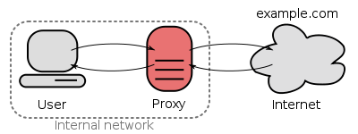

=============
Caching Proxy
=============

OPNsense is equipped with a fully featured forward caching (transparent) proxy.
A caching proxy reduces bandwidth and improves response times by caching and
reusing frequently-requested web pages. The Access Control Lists can be utilized
for user authentication and or as (category based) web filter.

Features include:

* Multi Interface Support
* Transparent Mode (including SSL/HTTPS)
* ICAP Support for Anti Virus/Malware Engine
* HTTP Proxy
* FTP Proxy
* User Authentication
* Access Control Lists (valid for both http(s) and ftp)
* (Compressed) Blacklist
* Category Based Web Filtering
* Can be combined with traffic shaper

--------------
Authenticators
--------------
User authentication can be done using OPNsense standard and build-in authenticators.
Currently these include:

* LDAP (incl. Microsoft Active Directory)
* Radius
* Local user manager
* No authentication

--------------
Access Control
--------------
OPNsense supports fine grained access control, base upon:

* Subnets
* Ports
* MIME types
* Banned IP’s
* Whitelists
* Blacklists
* Browser/User Agents

------------------
Traffic Management
------------------
The proxy can be combined with the traffic shaper and take full advantage of its
shaping features.Additionally it includes its own options:

* Maximum download size
* Maximum upload size
* Overall bandwidth throttling
* Per host bandwidth throttling

-------------------------
Category Based Web Filter
-------------------------
No need for additional plugins, such as squidGuard - as OPNsense has build-in
category based web filter support. Main features include:

* Fetch from a remote URL
* Supports flat file list and category based compressed lists
* Automatically convert category based blacklists to squid ACL's
* Keep up to date with the build-in scheduler
* Compatible with most popular blacklist

----------------
Transparent Mode
----------------
The transparent mode means all request will be diverted to the proxy without any
configuration on your client. Transparent mode works very well with unsecured http
requests, however with secured (SSL) https connection the proxy will become a
man-in-the-middle as the client will "talk" to the proxy and the proxy will encrypt
the traffic with its master key that the client is required to trust.

While we do not encourage the use of https in transparent mode, this feature is
scheduled for release in version 16.7.

.. Warning::
    Using a transparent HTTPS proxy can be a dangerous practice and may not be
    allowed by the services you use, for instance e-banking.

------------
WPAD And PAC
------------
If a transparent proxy cannot be used, OPNsense still supports automatic proxy
configuration via WPAD / PAC.

.. Warning::
    WPAD via DNS requires the web interface to run on the default HTTP port
    (TCP/80) which is also a security risk (MITM attacks). In such cases you
    should proxy the connection or avoid configuring the applicance from an
    untrusted network.

------------------------
Configuration / HOW-TO's
------------------------
More information on how to utilize OPNsense's proxy service can be found in:

Proxy Basic Setup
-----------------
:doc:`how-tos/cachingproxy`

Setup Web Filtering
-------------------
:doc:`how-tos/proxywebfilter`

Setup Transparent Mode (including SSL)
--------------------------------------
:doc:`how-tos/proxytransparent`

Setup WPAD/PAC
--------------
:doc:`how-tos/pac`

Setup ICAP Anti Virus/Malware Engine
------------------------------------
:doc:`how-tos/proxyicapantivirus`
