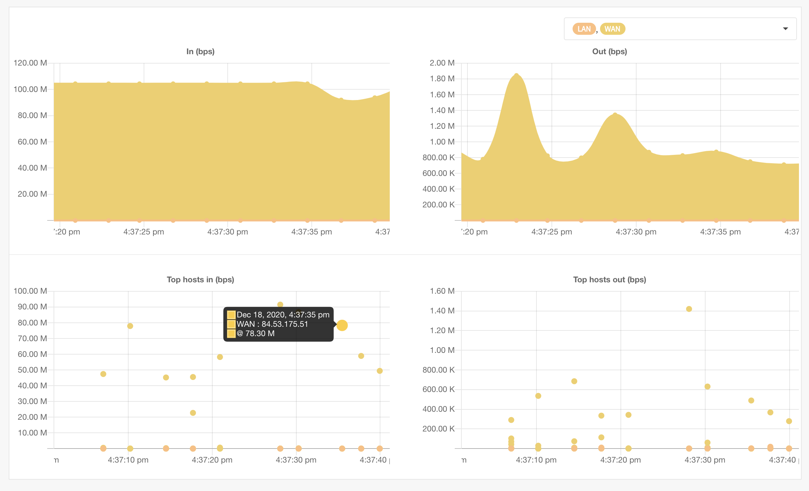
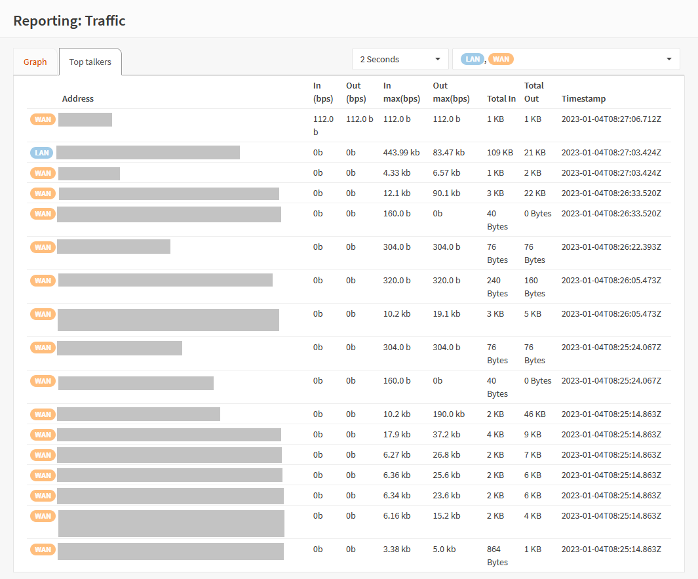

===================
Reporting: Traffic
===================

Under :menuselection:`Reporting --> Traffic` you will find a traffic monitor which show the current amount of
data flowing through your firewall, measured in bps (bits per second).

Graph
...............................

The top area of the screen shows an overview of all network adapters for both in- and outgoing traffic. You can
select the desired polling resolution with the dropdown left of the interface selection dropdown.

The graph below shows the top consumers over the same timespan, when you point to a dot it will show you the measured
bandwith for the selected host (the color matches the interface).

Top talkers
...............................

Although the graphical overview also shows the most active clients on the network, sometimes it is more convenient
to see the list of addresses and their current activity in a grid type overview.
This is where the "Top talkers" tab comes into play, the information is quite comparable to what a command line tool as
:code:`iftop` would display:

When opening this tab you will be presented with the most active addresses, including the amount of traffic
passed when measured and the last time traffic was seen from or to that address.

Every time the graph is updated, the grid will also be populated with new information.
