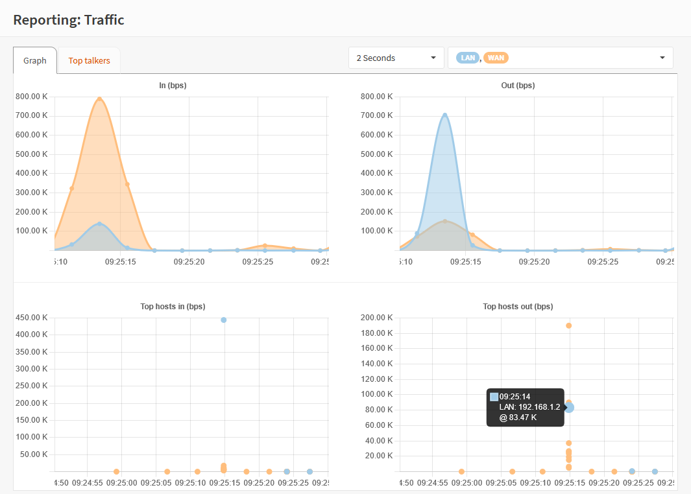

===================
Reporting Traffic
===================

Under :menuselection:`Reporting --> Traffic` you will find a traffic monitor which show the current amount of
data flowing through your firewall, measured in bps (bits per second).

The top area of the screen shows an overview of all network adapters for both in- and outgoing traffic.

Below the larger graphs, you will find a couple of options, which helps track current high traffic nodes on your network.

+---------------------------------+------------------------------------------------------------------------------------+
| Setting                         | Explanation                                                                        |
+=================================+====================================================================================+
| Interface                       | Hostname to display                                                                |
+---------------------------------+------------------------------------------------------------------------------------+
| Sort by                         | Sort by criteria                                                                   |
+---------------------------------+------------------------------------------------------------------------------------+
| Filter                          | Local traffic only, or All                                                         |
+---------------------------------+------------------------------------------------------------------------------------+
| Display                         | IP address or (fully qualified) hostname                                           |
+---------------------------------+------------------------------------------------------------------------------------+
| Top                             | Number of entries to show                                                          |
+---------------------------------+------------------------------------------------------------------------------------+

.. Note::

    When an interface doesn't report traffic and your certain there should be any, make sure to check if you have any
    services enabled that use netmap (zero copy) support on the selected interface (such as IPS and Sensei).
    When zero copy is used, packets won't by copied in the kernel in which case bpf can't read from the usual in memory buffer.

    :code:`bpf(4)` does support a zerocopy mode, in which case it will map the kernel memory pages directly
    (`freebsd/freebsd#310e3f9 <https://github.com/freebsd/freebsd/commit/310e3f93ddb4d35429a892af85c9b1cf4ef64ebe>`__),
    To enable, go to :menuselection:`System -> Settings -> Tunables` and add :code:`net.bpf.zerocopy_enable` set to :code:`1`

    Since this feature is marked experimental, the standard is not to use zero-copy.
