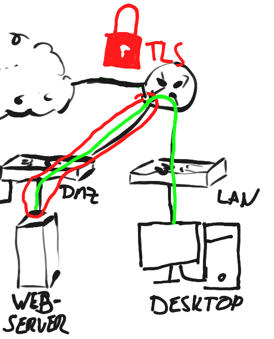
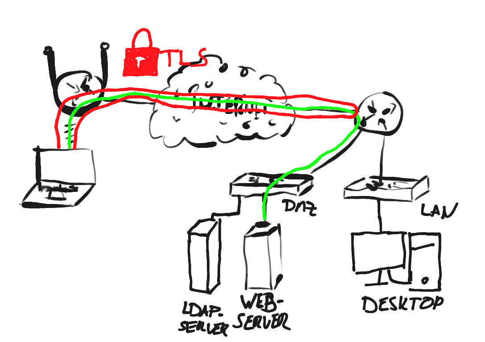
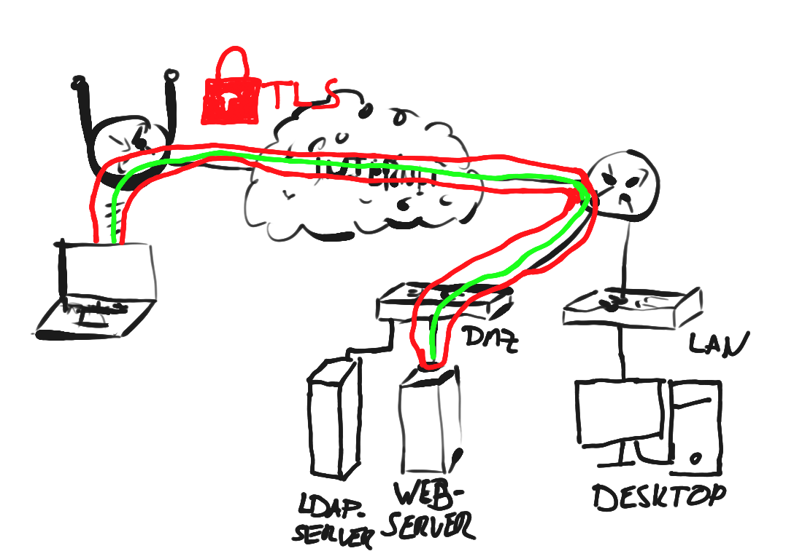

===========================
Reverse Proxy and Webserver
===========================

.. Note::
    All reverse proxies are plugins and need to be installed first.

Why should a reverse proxy be used?
===================================

The packet filter itself cannot decide what should be done in application protocols.
For such an inspection you can use deep packet inspection or a reverse proxy.

In addition, a reverse proxy can implement protocol specific access control lists
as well as other checks to protect the application behind. Such checks are malware,
spam, web attack detection and so on.

.. Warning::
    Reverse proxies support you to prevent common attacks to your
    web application by bots but will never provide a 100% success rate in detection of
    bad traffic.
    Especially a targeted attack will very likely be not detected because a lot of
    effort has been taken to prevent detection.
    Do not use a reverse proxy as a replacement / excuse for not fixing the main
    problems like known vulnerabilities in libraries, outdated software, or
    vulnerabilities in your own code by updating / removing them or by changing
    your own code.

Supported Reverse Proxies in OPNsense
=====================================

========= ==========================
ftp-proxy Makes FTP work
nginx     HTTP, TCP- and UDP streams
HAProxy   HTTP and TCP streams
postfix   SMTP (e-mail)
relayd    TCP streams
========= ==========================

Terms
=====

**Forward Proxy**

A Proxy which is used by a client to connect to the internet. It is usually
used in companies to scan traffic for malware. See the more specific pages
(:doc:`proxy`) for more background information.

**Reverse Proxy and Webserver**

A reverse proxy is software which takes a request or a connection from a client
and sends it to an upstream server. It may change some data if needed (for
exmaple inject HTTP header or perform access control). A reverse proxy can be
generic for any protocol, but is commonly used for HTTP(S).

A reverse proxy does not need to by fully aware of data it is transferring it needs
to know, which upstream is responsible to process it and some metadata to know
what it should do (like for caching a Cache-Control header and for
authorizing an Authentication header in HTTP).

A webserver, in contrast to a reverse proxy, finally processes the request
(the webserver contains the business logic in the web application) and sends
a response depending on the request, which may be modified or cached
by a reverse (for example Varnish_, nginx_) or forward proxy
(see :doc:`how-tos/proxyicapantivirus`, :doc:`how-tos/cachingproxy`).
For example, a webserver serves a file called index.html from the local file
system or processes an API endpoint and returns the result.
A web server usually has an API for calling external interpreters:

============ ========================== =================================================
**API**      **Typical Use Case**       **Implemented at (examples)**
============ ========================== =================================================
FastCGI      PHP, Rails                 PHP-FPM, nginx, Apache HTTPd
AJP          Java application servers   Tomcat, JBoss, WildFly, Apache HTTPd (mod_jk_)
(U)WSGI      Python                     Django_ via UWSGI
============ ========================== =================================================

Others include the interpreter directly into the webserver,
are written in this language or in a C/C++ extension:

============================================= ================================================
**Technology**                                **Used for**
============================================= ================================================
Passenger                                      Application Server for differnet Languages
nginx Unit_                                    Application Server for differnet Languages
Undertow_ (Raw, JBoss, WildFly)                Java application server
Apache Tomcat                                  Java application server
unit_, puma_, unicorn_                         Many Rack_ based frameworks (RoR_, Sinatrarb_, …)       
gunicorn_                                      Python application server
Apache HTTPd (with modules like mod_php)       Webserver with interpreter modules
============================================= ================================================

.. _Varnish: https://varnish-cache.org/
.. _nginx: https://www.nginx.com/resources/wiki/start/topics/examples/reverseproxycachingexample/
.. _Unit: https://unit.nginx.org/
.. _puma: https://github.com/puma/puma
.. _unicorn: https://bogomips.org/unicorn/
.. _gunicorn: https://gunicorn.org/
.. _Django: https://uwsgi-docs.readthedocs.io/en/latest/tutorials/Django_and_nginx.html
.. _Rack: https://rack.github.io/
.. _UWSGI: https://uwsgi-docs.readthedocs.io/en/latest/
.. _mod_jk: https://tomcat.apache.org/connectors-doc/webserver_howto/apache.html
.. _Undertow: http://undertow.io/
.. _RoR: https://rubyonrails.org/
.. _sinatrarb: http://sinatrarb.com/

**Upstream, Backend**

A single or multiple servers which can be used for load balancing the client
request to. All servers used in an upstream must act equally (same protocol
etc.) but do not need to run on the same port.

**Upstream Server, Backend Server**

This is your listening application like nginx on port 80 for HTTP or your
LDAP server on TCP/389.

**Frontends (HAProxy) and HTTP(S)/Stream Servers (nginx)**

These are the the configurations for the ports used for incoming connections.
For example, if you bind a port to TCP/80 (standard port of HTTP), you can
decide, what is going to be done with this request. The same is true for
connections.

**TLS and SSL**

TLS replaced SSL and it is used to protect the application protocol against a broad
range of attacks like snooping or data manipulation (for example ad injection,
redirects, manipulation of downloaded files like executables).

Modern clients and servers should support TLS 1.2 and TLS 1.3. All others should
be disabled.

TLS - Different ways to use it
==============================

1) Breaking up the connection on the firewall (down- and upstream are using TLS)
--------------------------------------------------------------------------------

In this setup we do have two TLS protected connections. One from the client to
the firewall, and one from the firewall to the backend.

The advantage of this setup is that you can use it to route based on paths or
other properties and you can present another certificate to the client.
For example, you can use an internal certificate on the server and the reverse
proxy will present a probably trusted certificate like one of Let's Encrypt to
the client. This simplifies certificate handling because the upstream client
may be invalid (for example outdated). Please note that it is not recommended
to disable certificate checks in the upstream but it may be required in some
setups.

2) Decrypt an encrypted upstream (downstream plain, upstream TLS protected)
---------------------------------------------------------------------------

This setup may not make much sense in most cases. It may have the advantage
if you have trouble with some software which does not allow a not encrypted
port but a special internal client does not support it. For example a machine
needs to talk to a server but cannot use TLS because the hardware does not
support it. If you need that, do not make it available via the internet
because there is probably a reason that the upstream server is TLS only.

3) TLS Offloading (downstream is TLS protected, upstream is plain)
------------------------------------------------------------------

This setup should be preferred when it is supported. It has the advantage
that it fully supports TLS for the client while it does not need a lot of
power to do a TLS handshake inside your own computer centre.

.. Warning::
    You should not use this for upstream servers reachable via untrusted newtworks.
    Use (1) or (4) in such cases.

(4) TLS Passthough
------------------

In this mode, the proxy will just pass though the connection and has no access
to the encrypted payload. You cannot match on anything of the protocol itself.
You may use some extension headers like SNI to decide, which upstream is used.
This setup is recommended if you only want some improved routing decisions
better than plain NAT.

.. Note::
    A reverse proxy can still get access to the encrypted content if it has the
    private Key of the server and a cipher without PFS_ is used. In other cases
    the connection can only be decrypted if one of the peers escrows the key.
    Firefox supports this via the environment SSLKEYLOGFILE_.
    This is not supported by OPNsense plugins.

.. _SSLKEYLOGFILE: https://developer.mozilla.org/en-US/docs/Mozilla/Projects/NSS/Key_Log_Format
.. _PFS: https://en.wikipedia.org/wiki/Forward_secrecy

Tutorials
=========

Basic Reverse Proxy Setup
-------------------------
* :doc:`how-tos/nginx`
* :doc:`how-tos/nginx_streams`
* :doc:`how-tos/mailgateway`

Setup Authentication
--------------------
* :doc:`how-tos/nginx_basic_auth`
* :doc:`how-tos/nginx_ip_acl`
* :doc:`how-tos/nginx_tls_auth`

Firewalling
-----------
* :doc:`how-tos/nginx_waf`

Misc
----
* :doc:`how-tos/nginx_hosting`
* :doc:`how-tos/haproxy_howtos`
