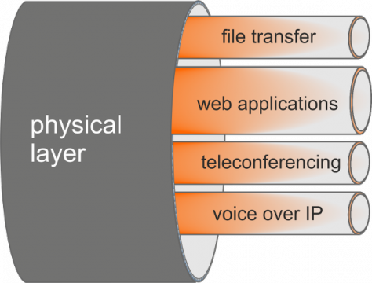

===============
Traffic Shaping
===============
Traffic shaping (also known as “packet shaping”) is the control of computer network
traffic in order to optimize or guarantee performance, lower latency, and/or
increase usable bandwidth by delaying packets that meet certain criteria. More
specifically, traffic shaping is any action on a set of packets (often called a
stream or a flow), which imposes additional delay on those packets such that they
conform to some predetermined constraint (a contract or traffic profile).

------------
Introduction
------------
Traffic shaping within OPNsense is very flexible and is organized around pipes,
queues and corresponding rules. The pipes define the allowed bandwidth, the queues
can be used to set a weight within the pipe and finally the rules are used to apply
the shaping to a certain package flow. The shaping rules are handled independently
from the firewall rules and other settings.

OPNsense traffic shaping is a reliable solution to limit bandwidth or prioritize
traffic and can be combined with other functions such as captive portal or high
availability (CARP).

Bandwidth limitations can be defined based upon the interface(s), IP source &
destination, direction of traffic (in/out) and port numbers (application).

Available bandwidth can be shared evenly over all users, this allows for
optimum performance at all times.

Traffic can also be prioritized by adding queues and defining weights. Strictly
speaking traffic is not really prioritized but applications with a higher weight can
consume more bandwidth than others when the total available bandwidth is limited.

The traffic shaper implementation uses IPFW and dummynet to offer a modern,
reliable solution with a low cpu footprint.

---------------
Dummynet & ipfw
---------------

Dummynet operates by first using the firewall to classify packets and
divide them into flows, using any match pattern that can be used in ipfw
rules.  Depending on local policies, a flow can contain packets for a
single TCP connection, or from/to a given host, or entire subnet, or a
protocol type, etc.

Packets belonging to the same flow are then passed to either of two different
objects, which implement the traffic regulation:

pipe
         A pipe emulates a link with given bandwidth, propagation
         delay, queue size and packet loss rate.  Packets are queued
         in front of the pipe as they come out from the classifier,
         and then transferred to the pipe according to the pipe's
         parameters.

queue
         A queue is an abstraction used to implement the WF2Q+ (Worstcase Fair
         Weighted Fair Queueing) policy, which is an efficient variant of the
         WFQ policy. The queue associates a weight and a reference pipe to each
         flow, and then all backlogged (i.e., with packets queued) flows linked
         to the same pipe share the pipe's bandwidth proportionally to their
         weights. Note that weights are not priorities; a flow with a lower
         weight is still guaranteed to get its fraction of the bandwidth even if
         a flow with a higher weight is permanently backlogged.

In practice, pipes can be used to set hard limits to the bandwidth that a
flow can use, whereas queues can be used to determine how different flow
share the available bandwidth.

The shaping rules can be defined in the rules section of the traffic shaper.

-----------------------
Status / statistics
-----------------------

To check if your shaper is acting like intended, you can use the status page (:menuselection:`Firewall -> Shaper -> Status`).

This component will show a breakdown of configured pipes, queues and rules showing the amount of traffic passed through it
since the last restart of the service including the timestamp when that happened.

If flows are active, you can show their details using the "Show active flows" checkbox, do remember to refresh your view after
changing these settings.

The rules are not shown by default, you can use the "Show rules" checkbox to enabled those,
this option can help you identifying misconfigurations more easily,
since the underlaying technology (:code:`ipfw`) keeps track of data on a per rule basis.

.. Tip::

    Make sure to use easy to find descriptions, these will ease debugging when traffic isn't being handled as expected.

---------------------------
Configuration / How-tos
---------------------------

.. toctree::
   :maxdepth: 2
   :titlesonly:

   how-tos/shaper_dedicated_bw
   how-tos/shaper_share_evenly
   how-tos/shaper_limit_per_user
   how-tos/shaper_prioritize_using_queues
   how-tos/shaper_guestnet
