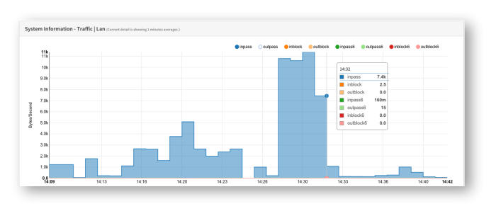
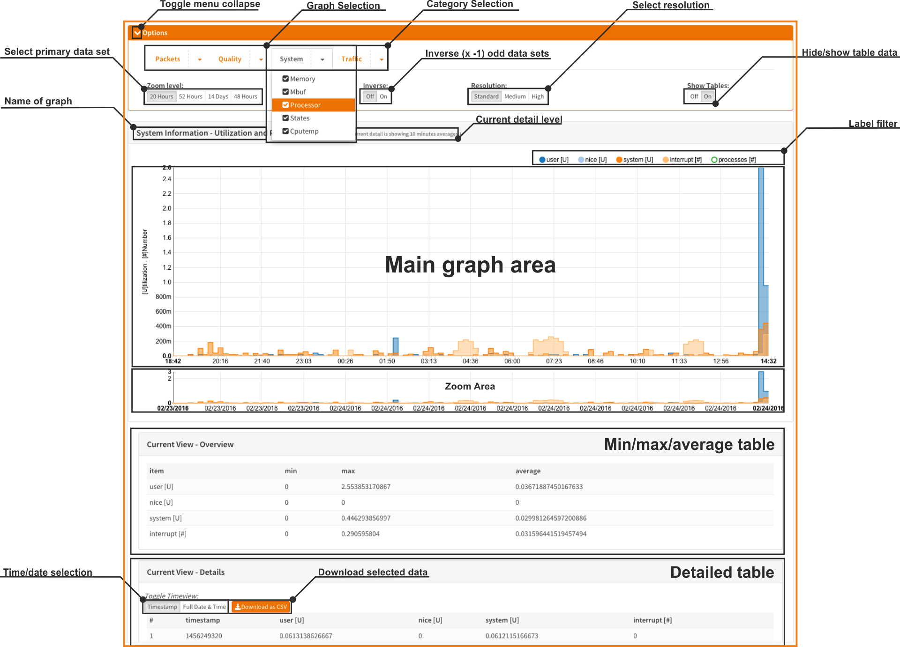
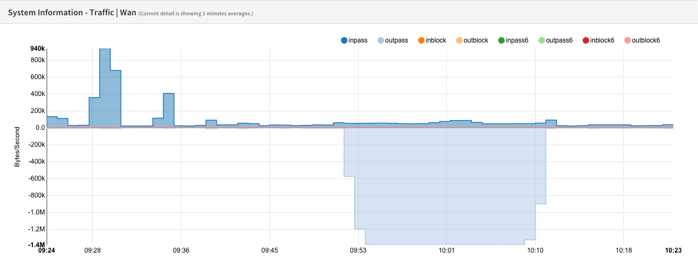
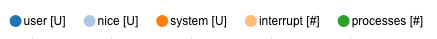
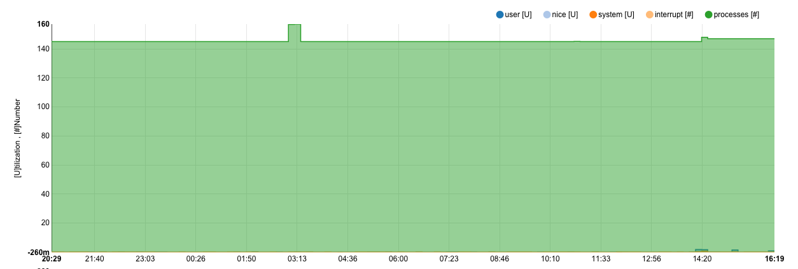
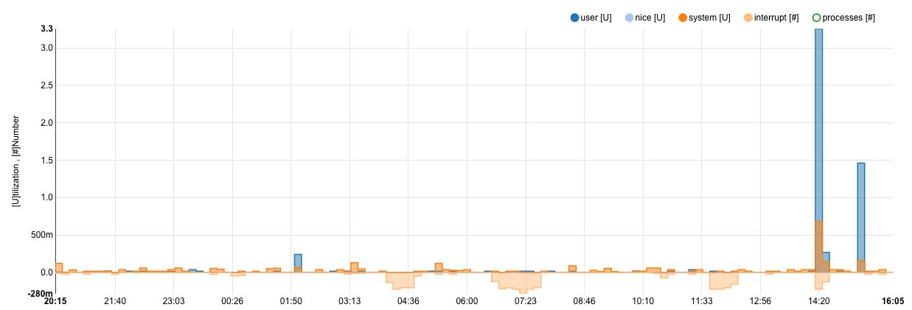
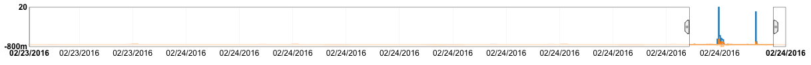
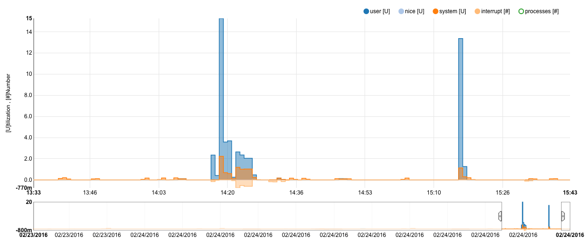
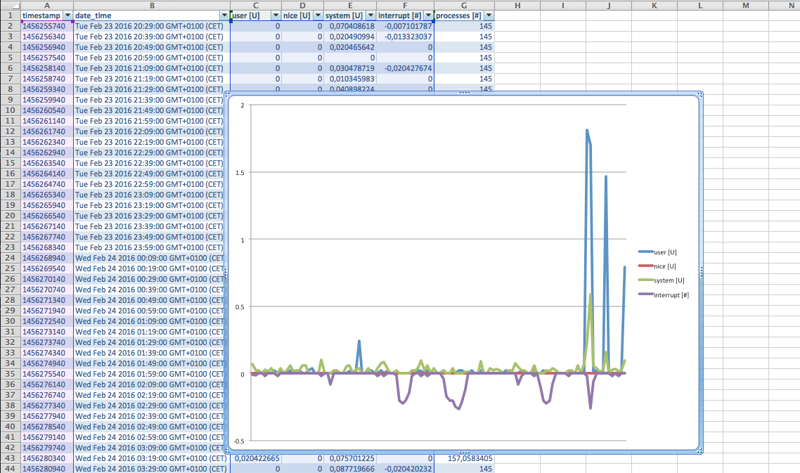

================================
System Health & Round Robin Data
================================

System Health is a dynamic view on RRD data gathered by the system. It can be accessed via :menuselection:`Reporting --> Health`. It allows you
to dive into different statistics that show the overall health and performance of
the system over time.

The system health module will enable you to track down issues faster and easier
than traditional static RRD graphs and it allows you to zoom in.

---------------
Data collectors
---------------
System Health has the following primary data collectors:

Packets
  Packets show the number of packets per second traveling to and from a certain
  interface.

Quality
  Quality show latency and packet loss of the monitored gateways (ip).

System
  The system section is used for sensor data regarding the system utilization,
  such as memory usage, mbufs, states, processes and (when available) cpu temperature.

Traffic
  Shows traffic graphs for each interface including vpn (ipsec).

Depending on the features in use there may be more or less graphs available.

---------------------
GUI Features Overview
---------------------
Please see the screenshot below for all element of the system health module.
Each element will be explained in the next chapters.

Toggle menu collapse
--------------------
This feature will show or hide the top menu.

Category Selection
------------------
The category items are tabs with drop down menu's. Click on one of the categories
and select the graph you like to dive into.

Graph Selection
---------------
Part of the drop down menu, where you can select the graph to view.

Select primary dataset
----------------------
Select the RRD dataset you want to use. The more to the left the lower the maximum
resolution. By default the graphs are opened with the highest available RRD resolution.

Inverse
-------
By selecting **Inverse** each odd dataset is reversed in direction (times minus one),
this is especially useful for traffic flows where you can plot ingoing and outgoing flows
in different directions.

Resolution
----------
The resolution determines the maximum number of datapoints that will be shown in
the graph and therefore indirectly influences the scale of the calculated averages.

Hide/show table data
--------------------
By default the table data is hidden, you can show it by toggling the **Show Tables**
to **On**.

The table data area consists of the min/max/average and detailed table data area.

Name of the graph
-----------------
Shows the name of the selected graph.

Current Detail Level
--------------------
Since the data is dynamically rendered it will automatically calculate the averages
and show you the current detail level in this area.

Label filter
------------

The label filter can be used to filer out data you do not want to see. Click once
to disable or double click to select only this set.

A nice sample can be seen here, where the *processes* obscure all other data.

Just click once on *processes* to hide this data set, notice that the scales will
adapt as well.

Main graph area
---------------
The main graph area show the full graph or just the part you selected in the zoom
area with more detail.

Zoom Area
---------
The zoom area can be used to select and zoom in on one part of the graph, the scales
are adapted automatically and any tables will be updated as well.

This feature is very useful to zoom in on issues or for showing just part of the
graph.

To use, click on it and hold while moving your pointer to another part of the zoom
area, on mouse up (release mouse click) the main graph area will be updated accordingly.
The zoom area will also be updated with more detailed data - when available - for the
selected area.

A sample selection:

And the result:

Min/max/average table
---------------------
If **Show Tables** is on then this area will show:
* Minimum value of each dataset
* Maximum value of each dataset
* Average value of each dataset

Detailed table
--------------
If **Show Tables** is on then this area will show each value that is plotted in
the graph. You can toggle the time and date view from timestamp to human readable
values and export the data to as comma separated file (.CSV).

The exported dataset can be used for your own reporting.

