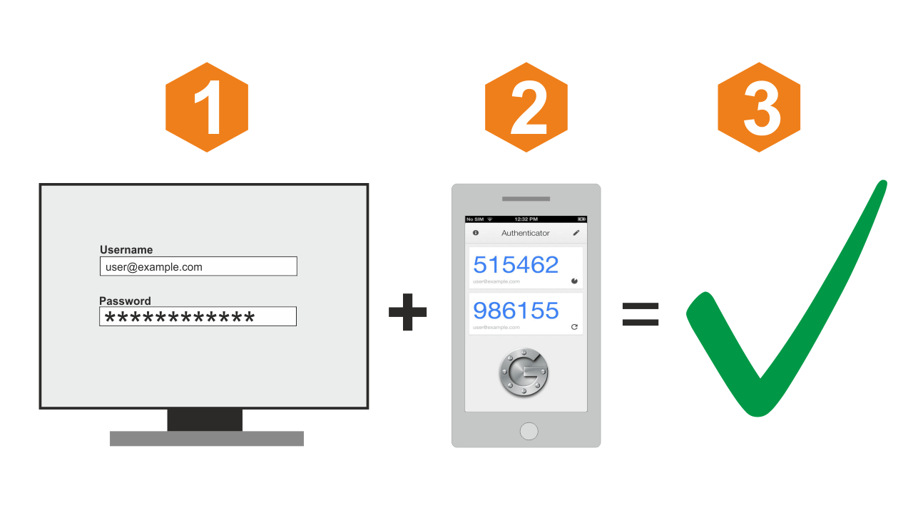

=========================
Two-factor authentication
=========================

Two-factor authentication also known as 2FA or 2-Step Verification is an authentication
method that requires two components, such as a pin/password + a token.

OPNsense (version >=16.1.14) offers support for Two-factor authentication throughout
the entire system, with one exception being console/ssh access.

Supported services are:

* OPNsense Graphical User Interface
* Captive Portal
* Virtual Private Networking - OpenVPN & IPsec
* Caching Proxy

----------------------------
Time-based One-time Password
----------------------------
TOTP is an algorithm that computes a one-time password from a shared secret key
and the current time. OPNsense supports RFC 6238.

--------------------
Google Authenticator
--------------------
OPNsense fully supports the use of Google's Authenticator application.
This application can generate tokens on Android, iOS and BlackBerry OS.
The usage of this application is free and very simple to setup using OPNsense.

-----------------
Other TOTP tokens
-----------------
The 2FA feature can be used with any time based one-time password token, although
it may be necessary to convert the tokens seed to the used format (base32).

---------------------
Configuration & Setup
---------------------
To setup see: :doc:`how-tos/two_factor`.
