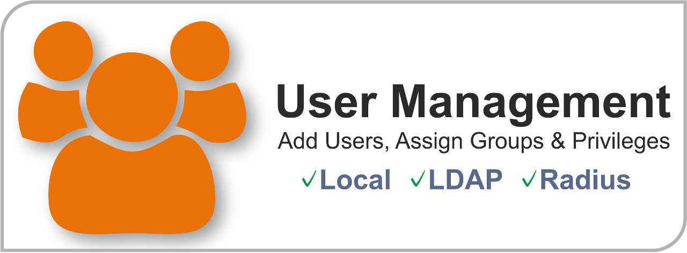

=================
 User Management
=================

The user manager of OPNsense allows for controlling access to the different
part (pages) of the configurator as well as controlling access to particular
services on a per user bases.

Authentication
--------------
OPNsense offers integration with external servers for services that require user
authentication. These services include:

* IPsec
* OpenVPN
* Captive Portal
* Proxy

Integrated into OPNsense are the **Local User Database** and **Voucher Server**.
The Voucher Server is intended to be used with the Captive portal.

External service currently supported are:

* LDAP (OpenLDAP, MS Active Directory, Novell eDirectory)
* Radius

Authorization
-------------
Besides authenticating, user authorization to access parts of the configuration
can also be setup with an external server, but in order to grant the appropriate
privileges to the users they need to be imported in OPNsense's local user manager.
This way one can validate a user against its externally stored password and have
a fine grained control over the configuration pages that user may access.

Users, Groups & Privileges
--------------------------
When using the local user manager, either stand alone or on combination with an
external authentication server one can define groups to combine a set of privileges
for a specific user group. A user should be an individual, a group needs to be
specific in such a way that anyone of that group can be granted the same access
rights, called privileges.

Services
----------------------------------

The authentication service to use can be configured using the settings in **System->Access->Settings**.
Here you can also find timeout settings for the user sessions and for local user accounts you will have the option
to improve security using password policy constraints.

Below an overview of the settings, which are available:

=====================================  ============================================================================================
 **Session Timeout**                   Session timeout if other then our default.
 **Authentication Server**             Primary authentication method to use.
 **Authentication Server (fallback)**  Fallback option if primary service fails.
 **Policy**                            Enable password policy constraints.
 **Duration**                          [Policy] Password duration, optionally define how often the user should change his or her password.
 **Length**                            [Policy] Minimum password length to require.
 **Complexity**                        [Policy] Enforce password complexity checks.
=====================================  ============================================================================================

Configuration
-------------

Local User Manager
------------------
:doc:`how-tos/user-local`

LDAP
----
:doc:`how-tos/user-ldap`

Radius
------
:doc:`how-tos/user-radius`
