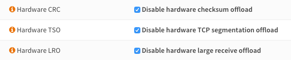
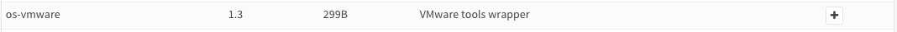

==================================
Virtual & Cloud-Based Installation
==================================

------------
Local/Server
------------
Installing OPNsense on a virtual machine can be done by using the DVD ISO image.
Full instructions are available in chapter :doc:`install`.

General tips
------------
For optimum performance and compatibility, consider the following guidelines:

* Minimum required RAM is 1 GB
* Minimum recommended virtual disk size of 8 GB
* Disable all hardware off-loading settings in :menuselection:`Interfaces --> Settings`

VMware ESXi
--------------------

VMware offers full instructions for installing FreeBSD, which can be found
`here <https://partnerweb.vmware.com/GOSIG/FreeBSD_14x.html>`__.

To install VMware Tools, go to :menuselection:`System --> Firmware --> Plugins` and install
**os-vmware** by clicking on the **+** sign next to it.

.. Note::

   While other network setups may work fine, it is recommended to use VMXNET3 according to VMware's Compatibility Guide.

Xen
--------------------
To install Xen tools, go to :menuselection:`System --> Firmware --> Plugins` (tick **Show (Tier 3) community plugins**) and install
**os-xen** by clicking on the **+** sign next to it.

Hyper-V
--------------------
Both Hyper-V Generation 1 and 2 virtual machines are supported out of the box with no additional drivers
or tools needed.

.. Note::

   Secure Boot must be disabled in the Hardware > Security section of the VM.

KVM
------
To install QEMU Guest Agent, go to :menuselection:`System --> Firmware --> Plugins` (tick **Show (Tier 3) community plugins**) and install
**os-qemu-guest-agent** by clicking on the **+** sign next to it.

**KVM chipsets**
OPNsense (based on FreeBSD) supports running under both the legacy i440FX machine type and the newer Q35 chipset.

Others
--------------------
OPNsense can be installed on all virtual machines that support FreeBSD (such as Bhyve or VirtualBox).

Note: to install VirtualBox Guest Additions, go to :menuselection:`System --> Firmware --> Plugins` (tick **Show (Tier 3) community plugins**) and install
**os-virtualbox** by clicking on the **+** sign next to it.

Hosted
--------------------
For hosted installations where you cannot install using the DVD ISO, an alternative
approach is available in the form of **opnsense-bootstrap**.

opnsense-bootstrap
------------------
opnsense-bootstrap(8) is a tool that can completely reinstall a running system
in place for a thorough factory reset or to restore consistency of all the OPNsense
files. It can also wipe the configuration directory, but it does not do so by default.

The tool will automatically pick up the latest available version and build a chain of
trust by using current package fingerprints -> CA root certificates -> HTTPS -> OPNsense
package fingerprints.

It can also convert a supported stock FreeBSD release into an OPNsense
installation.  Both UFS and ZFS installations are supported.

opnsense-bootstrap is available at our
`GitHub source repository <https://github.com/opnsense/update>`__

--------------------
Amazon AWS EC2 Cloud
--------------------
.. image:: how-tos/images/amazon-web-services.png
    :height: 80px

Installing OPNsense in Amazon Web Services can be a daunting task as no console is
offered. Luckily, an easy-to-install AMI is available in the AWS Marketplace.

See our how-to for :doc:`how-tos/installaws`.

--------------------
Microsoft Azure
--------------------
.. image:: how-tos/images/Azure.png
    :height: 80px

OPNsense is available in the Microsoft Azure Marketplace as an easily installable virtual appliance.

See our how-to for :doc:`how-tos/installazure`.

-------------
Common Issues
-------------
Some common issues have been reported for different virtual environments.
You can find known solutions to these problems below.

If your problem is not listed, always try the General tips mentioned in this
article first.

File copy failed during installation
-----------------------------------------
This issue is most likely caused by a low memory setting. Make sure your virtual
OPNsense installation has a minimum of 1 GB of RAM.

Disk Errors on VMware
-----------------------------------------
This issue can be caused by a defective drive. Changing the drive mode to IDE has
been reported to help for certain ESXi versions.

NAT / performance issues on XenServer/XCP-NG
-----------------------------------------------
This issue has been reported to be solved by disabling TX checksum offloading on Vifs (only there, not also in OPNsense DomU) - for details see this `documentation <https://docs.xcp-ng.org/guides/pfsense/#3-disable-tx-checksum-offload>`__.

Traffic Shaper does not work on VMware
-----------------------------------------
If you are using the VMXNET3 driver, try switching to E1000 instead.
