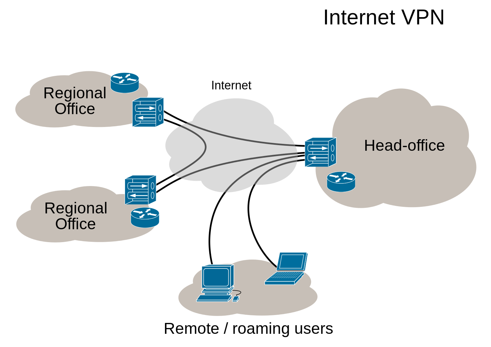
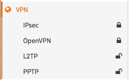

==========================
Virtual Private Networking
==========================

A virtual private network secures public network connections and in doing so it
extends the private network into the public network such as internet. With a VPN
you can create large secure networks that can act as one private network.

(picture from `wikipedia <https://en.wikipedia.org/wiki/File:Virtual_Private_Network_overview.svg>`__)

Companies use this technology for connecting branch offices and remote users
(road warriors).

OPNsense supports VPN connections for branch offices as well as remote users.

Creating a single secured private network with multiple branch offices connecting
to a single site can easily be setup from within the graphical user interface.
For remote users, certificates can be created and revoked and a simple to use export
utility makes the client configuration a breeze.

OPNsense offers a wide range of VPN technologies ranging from modern SSL VPNs to
well known IPsec as well as WireGuard and Zerotier via the use of plugins.

--------------------------
IPsec
--------------------------

Since IPsec is used in many different scenario's and sometimes has the tendency to be a bit complicated, we
will describe different usecases and provide some examples in this chapter.

.................................
General context
.................................

The IPsec module incorporates different functions, which are grouped into various menu items. Since the start of our
project we have been offering IPsec features based on the legacy :code:`ipsec.conf` format, which we are migrating to
`swantcl.conf <https://docs.strongswan.org/docs/5.9/swanctl/swanctlConf.html>`__ as of version 23.1. While
migrating the existing featureset we came to the conclusion that the world has changed quite a bit and in order to
offer better (api) access to the featureset available we decided to plan for deprecation of the legacy "Tunnel settings" as they
have existed since we started. No timeline has been set, only a feature freeze on tunnels using the "Tunnel settings" menu item.

One of the main goals for the long run is to better align the gui components so they reflect the reality underneath, as we use
`strongswan <https://www.strongswan.org/>`__, our aim is to follow their terminology more closely than we previously did.

The following functions are available in the menu (as of OPNsense 23.1):

* Connections

  * New configuration tool offering access to the connections and pools sections of the :code:`swanctl` configuration

* Tunnel Settings

  * Legacy IPsec configuration tool

* Mobile Clients

  * Offering access to various options of the `attr <https://docs.strongswan.org/docs/5.9/plugins/attr.html>`__ plugin and pool configurations for legacy tunnels

* Pre-Shared Keys

  * Define `secrets <https://docs.strongswan.org/docs/5.9/swanctl/swanctlConf.html#_secrets>`__ to be used for local authentication.

* Key Pairs

  * For public key authentication collect public and private keys.

* Advanced Settings

  * Define passthrough networks (to exclude from kernel traps), logging options and some generic options

* Status Overview

  * Shows tunnel statusses

* Lease Status

  * For mobile clients, show address leases for various pools configured

* Security Association Database

  * Shows security associations, the fundamental concept of IPsec describing a relationship between two or more entities

* Security Policy Database

  * Installed security policies describing which traffic is allowed to pass a tunnel

* Virtual Tunnel Interfaces

  * Edit or create new :code:`if_ipsec(4)` interfaces and show the ones created by legacy tunnels

* Log File

  * Inspect log entries related to IPsec

.. Note::

    When migrating Pre-Shared Key type tunnels to connections, make sure to add an entry in the "Pre-Shared Keys" module as well.
    If both ends should use their own identifier, fill in both local and remote values. The legacy module requested this information in the phase 1
    page and wrote the same information to the secrets.

.................................
Security policies and routing
.................................

In order to pass traffic over an IPsec tunnel, we need a policy matching the traffic. By default when adding a phase 2 (or child) policy
a "kernel route" is installed as well, which traps traffic before normal routing takes place.

.. Note::

  Without a policy in place for the tunnel, traffic won't be accepted, in case a policy with a kernel route overlaps a local or locally routed network
  the traffic will not be received by the host in question.

.. Tip::

  When matching overlapping networks in a policy (VTI or overlapping networks), make sure to exclude your own network segments in the
  :code:`Passthrough networks` option in :menuselection:`VPN -> IPsec -> Advanced Settings` to prevent traffic being blackholed.

.................................
Firewall rules
.................................

When using the legacy tunnels and :code:`Disable Auto-added VPN rules` is not checked in :menuselection:`VPN --> IPsec --> Advanced Settings`
some automatic firewall rules are created for remote hosts connecting to this one.
The new connections feature does not offer this and (WAN) rules have to be specified manually in order to connect to IPsec on this host.

The relevant protocols and ports for IPsec are the following:

* Protocol: ESP (https://en.wikipedia.org/wiki/IPsec#Encapsulating_Security_Payload)
* Port: 500/UDP (https://en.wikipedia.org/wiki/Internet_Security_Association_and_Key_Management_Protocol)
* Port: 4500/UDP (https://en.wikipedia.org/wiki/NAT_traversal#IPsec)

.. Note::

  One of the main reasons we are not offering automatic rules is that their either more open than expected (allow IPsec from anywhere)
  or too closed as the rule engine will "guess" the remote endpoint (in case of a fqdn).

The default behavior of our firewall is to block inbound traffic, which also means traffic using the tunnel should
be allowed explicitly, the :menuselection:`Firewall --> Rules --> IPsec` menu items offer access to the IPsec traffic policies.

.................................
Implementation schemes
.................................

When setting up IPsec VPNs there are two main types of scenario's with their own advantages and disadvantages.

Policy based
--------------------------

The first one is the standard policy based tunnel, which guards the security of the tunnel with policies and installs kernel
traps to send traffic over the tunnel in case it matches these policies. For example a local network :code:`192.168.1.0/24`
sending traffic to a remote location responsible for :code:`192.168.2.0/24`. The advantage of this scenario is the ease of setup,
no routes are needed to be configured, when in this example :code:`192.168.1.10` contacts :code:`192.168.2.10` the packets
are seamlessly forwarded over the tunnel to the remote location.

When local traffic doesn't match the policies in question due to the tunnel needing Network Address Translation,
that's also possible as long as policies are manually added to the security policy database,
this is also referred to as "NAT before IPsec".

Route based (VTI)
--------------------------

Route based, also known as VTI, tunnels are using a virtual interface known as :code:`if_ipsec(4)`, which can be found under
:menuselection:`VPN -> IPsec -> Virtual Tunnel Interfaces`. This links two ends of the communication for routing purposes
after which normal routing applies. The "(Install) Policies" checkmark needs to be disabled in this case for the child (phase 1 in the legacy tunnel configuration)
definition. Usually the communication policy (phase 2 or child) is set to match all traffic (either :code:`0.0.0.0/0` for IPv4 or :code:`::/0` for IPv6).

So the same example as the policy based option would need (static) routes for the destinations in question (:code:`192.168.1.0/24` needs
a route to :code:`192.168.2.0/24` and vice versa), peering happens over a small network in another subnet (for example :code:`10.0.0.1` <-> :code:`10.0.0.2`)
bound to the tunnel interface.

The advantage of this type of setup is one can use standard or advanced routing technologies to forward traffic around tunnels.

.. Note::

    In order to filter traffic on the :code:`if_ipsec(4)` device some tunables need to be set. Both :code:`net.inet.ipsec.filtertunnel`
    and :code:`net.inet6.ipsec6.filtertunnel` need to be set to :code:`1` and :code:`net.enc.in.ipsec_filter_mask` and :code:`net.enc.out.ipsec_filter_mask`
    need to be set to :code:`0` in order to allow rules on the device. The downside is that policy based tunnels (:code:`enc0`) can not be filtered
    anymore as this changes the behaviour from filtering on the :code:`enc0` device to the :code:`if_ipsec(4)` devices.

.. Warning::

    Currently it does not seem to be possible to add NAT rules for :code:`if_ipsec(4)` devices.

.. Warning::

    In order to reliably setup a VTI tunnel, both ends should use static ip addresses. Although in the legacy configuration it
    was possible to resolve hostnames, this will never lead to a stable configuration as the :code:`if_ipsec(4)` device
    matches both source and destination `[#] <https://github.com/freebsd/freebsd-src/blob/c8ee75f2315e8267ad814dc5b4645ef205f0e0e1/sys/net/if_ipsec.c#L479>`__
    before accepting the traffic and has no knowledge about any external changes.

.................................
Road Warriors / Mobile users
.................................

IPsec may also be used to service remote workers connecting to OPNsense from various clients, such as Windows, MacOS, iOS and Android.
The type of client usually determines the authentication scheme(s) being used.

In case clients should be offered default settings, these can be configured from :menuselection:`VPN -> IPsec -> Mobile Clients`.
Pool options (Virtual IPvX Address Pool) on this page will be used by the legacy tunnel configuration only, when using the new connections
module one may configure different pools per connection.

The examples section contains various options available in OPNsense. When using the new "connections" option available
as of OPNsense 23.1, different `examples from Strongswan <https://docs.strongswan.org/docs/5.9/interop/windowsClients.html>`__
are usually quite easy to implement as we follow the `swantcl.conf <https://docs.strongswan.org/docs/5.9/swanctl/swanctlConf.html>`__
format quite closely in the new module.

The following client setup examples are available in our documentation:

.. toctree::
  :maxdepth: 2
  :titlesonly:

  how-tos/ipsec-rw-android
  how-tos/ipsec-rw-linux
  how-tos/ipsec-rw-w7

.................................
Examples
.................................

This paragraph offers examples for some commonly used implementation scenarios.

Legacy (:menuselection:`VPN -> IPsec -> Tunnel Settings`)
------------------------------------------------------------------------------

.. toctree::
   :maxdepth: 2
   :titlesonly:

   how-tos/ipsec-s2s
   how-tos/ipsec-s2s-binat
   how-tos/ipsec-s2s-route
   how-tos/ipsec-s2s-route-azure
   how-tos/ipsec-rw

.. Note::

 Using Network Address Translation in policy based tunnels is different, due to the fact that the installed IPsec policy
 should accept the traffic in order to encapsulate it. The `IPSec BINAT` document will explain how to apply translations.

New > 23.1 (:menuselection:`VPN -> IPsec -> Connections`)
------------------------------------------------------------------------------

.. toctree::
   :maxdepth: 2
   :titlesonly:

   how-tos/ipsec-s2s-conn
   how-tos/ipsec-s2s-conn-route
   how-tos/ipsec-s2s-conn-binat

.. Tip::

    The number of examples for the new module on our end is limited, but for inspiration it's often a good
    idea to walkthrough the examples provided by `Strongswan <https://wiki.strongswan.org/projects/strongswan/wiki/UserDocumentation#Configuration-Examples>`__.
    Quite some swanctl.conf examples are easy to implement in our new module as we do follow the same terminology.

.................................
Tuning considerations
.................................

Depending on the workload (many different IPsec flows or a single flow), it might help to enable multithreaded crypto mode
on :code:`ipsec`, in which case cryptographic packets are dispatched to multiple processors (especially when only a single
tunnel is being used).

In order to do so, add or change the following tunable in :menuselection:`System --> Settings --> Tunables`:

.. Note::

    :code:`net.inet.ipsec.async_crypto` = **1**

To distribute load better over available cores in the system, it may help to enable :doc:`receive side scaling </troubleshooting/performance>`.
In which case the following tunables need to be changed:

.. Note::

    * :code:`net.isr.bindthreads` = **1**
    * :code:`net.isr.maxthreads` = **-1**   <-- equal the number of cores in the machine
    * :code:`net.inet.rss.enabled` = **1**
    * :code:`net.inet.rss.bits` = **X** <-- see :doc:`rss </troubleshooting/performance>` document.

.................................
Miscellaneous variables
.................................

Path MTU Discovery
--------------------------

When trying to enforce path mtu discovery (`PMTU <https://en.wikipedia.org/wiki/Path_MTU_Discovery>`__), you need to make
sure packets leave the network with the :code:`DF` set. The kernel offers a tunable :code:`net.inet.ipsec.dfbit` which
offers 3 options, :code:`0`, clear the bit on packets leaving the firewall (default), :code:`1`, set the DF bit or :code:`2`
to copy the bit from the inner header.

.................................
Diagnostics
.................................

In order to keep track of the connected tunnels, you can use the :menuselection:`VPN -> IPsec -> Status Overview`
to browse through the configured tunnels.

The :menuselection:`VPN -> IPsec -> Security Policy Database` is also practical to gain insights in the registered policies,
when NAT is used, the additional SPD entries should be visible here as well.

When troubleshooting problems with your firewall, it is very likely you have to check
the logs available on your system. In the UI of OPNsense, the log files are generally grouped
with the settings of the component they belong to. The log files can be found in the "Log file" menu item.

.. Tip::

    When trying to debug various issues, the amount of log information gathered can be configured using the settings
    in :menuselection:`VPN -> IPsec -> Advanced Settings`.

.................................
Custom configurations
.................................

In some (rare) cases one might want to add custom configuration options not available in the user interface, for this reason we
do support standard includes.

While the :code:`swanctl.conf` and the legacy :code:`ipsec.conf` configuration files are well suited to define IPsec-related configuration parameters,
it is not useful for other strongSwan applications to read options from these files.
To configure these other components, it is possible to manually append options to our default template, in which case files
may be placed in the directory :code:`/usr/local/etc/strongswan.opnsense.d/` using the file extention :code:`.conf`

IPsec configurations are managed in `swantcl.conf <https://docs.strongswan.org/docs/5.9/swanctl/swanctlConf.html>`__ format (as of 23.1), merging your own additions is possible by
placing files with a :code:`.conf` extension in the directory :code:`/usr/local/etc/swanctl/conf.d/`.

.. Warning::

    Files added to these directories will not be mainted by the user interface, if you're unsure if you need this, it's likely
    a good idea to skip adding files here as it might lead to errors difficult to debug.

.. Note::

    Prior to version 23.1 it was also possible to add secrets and ipsec configurations in :code:`/usr/local/etc/ipsec.secrets.opnsense.d/`
    and :code:`/usr/local/etc/ipsec.opnsense.d/`, with the switch to 23.1 these files are deprecated and should be manually migrated into swanctl.conf
    format.

--------------------------
OpenVPN (SSL VPN)
--------------------------

One of the main advantages of OpenVPN in comparison to IPsec is the ease of configuration, there are fewer settings involved
and it's quite simple to export settings for clients.

.................................
General context
.................................

The OpenVPN module incorporates different functions to setup secured networks for roadwarriors and side to side connections.
Since the start of our project we organized the openvpn menu section into servers and clients, which actually is a role
for the same OpenVPN process. As our legacy system has some disadvantages which are difficult to fix in a migration, we have chosen
to add a new component named :code:`Instances` in version 23.7 which offers access to OpenVPN's configuration in a similar way as
the upstream `documentation <https://openvpn.net/community-resources/reference-manual-for-openvpn-2-6/>`__ describes it.
This new component will eventually replace the existing client and server options in a future version of OPNsense, leaving
enough time to migrate older setups.

.. Tip::

  When upgrading into a new major version of OPNsense, always make sure to read the release notes to check if your setup
  requires changes.

.. Note::

  OpenVPN on OPNsense can also be used to create a tunnel between two locations, similar to what IPsec offers. Generally
  the performance of IPsec is higher which usually makes this a less common choice.
  Mobile usage is really where OpenVPN excells, with various (multifactor) authentication options and
  a high flexibility in available network options.

The following functions are available in the menu (as of OPNsense 23.7):

* Instances

  * New instances tool offering access to server and client setups

* Servers

  * Legacy server configuration tool

* Clients

  * Legacy client configuration tool

* Client Specific Overrides

  * Set client specific configurations based on the client’s X509 common name.

* Client Export

  * Export tool for client configurations, used for server type instances

* Connection Status

  * Show tunnel statusses

* Log File

  * Inspect log entries related to OpenVPN

....................................
Public Key Infrastructure  (X.509)
....................................

OpenVPN is most commonly used in combination with a public key infrastructure, where we use a certificate autority which
signs certificates for both server and clients (Also know as TLS Mode).
More information about this topic is available in our  :doc:`Trust section <certificates>`.

.................................
Firewall rules
.................................

To allow traffic to the tunnel on any interface, a firewall rule is needed to allow the tunnel being established.
The default port for OpenVPN is :code:`1194` using protocol :code:`UDP`.

After communication has been established, it's time to allow traffic inside the tunnel. All OpenVPN interfaces defined in
OPNsense are  :doc:`grouped <firewall_groups>` as `OpenVPN`.

.. Tip::

    In order to use features as policy based routing or manual routes, you can :doc:`assign <interfaces>` the underlying
    devices and use them in a similar fashion as physical interfaces.

.................................
Examples
.................................

This paragraph offers examples for some commonly used implementation scenarios.

.. Note::

    When using a site to site example with :code:`SSL/TLS` instead of a shared key, make sure to configure "client specific overrides"
    as well to correctly bind the remote networks to the correct client.

Legacy (:menuselection:`VPN -> OpenVPN -> Client|Server`)
------------------------------------------------------------------------------

.. toctree::
   :maxdepth: 2
   :titlesonly:

   how-tos/sslvpn_s2s
   how-tos/sslvpn_client

New (:menuselection:`VPN -> OpenVPN -> Instances`)
------------------------------------------------------------------------------

.. toctree::
   :maxdepth: 2
   :titlesonly:

   how-tos/sslvpn_instance_s2s
   how-tos/sslvpn_instance_roadwarrior

.................................
Client Specific Overrides
.................................

The mechanism of client overrides utilises OpenVPN :code:`client-config-dir` option, which offer the ability to use
specific client configurations based on the client's X509 common name.

It is possible to specify the contents of these configurations in the gui under :menuselection:`VPN -> OpenVPN -> Client Specific Overrides`.
Apart from that, an authentication server (:menuselection:`System -> Access -> Servers`) can also provide client details in special cases when returning
:code:`Framed-IP-Address`, :code:`Framed-IP-Netmask` and :code:`Framed-Route` properties.

.. Tip::

      Radius can be used to provisioning tunnel and local networks.

A selection of the most relevant settings can be found in the table below.

.. csv-table:: Client Specific Overrides
   :header: "Parameter", "Purpose"
   :widths: 30, 40

   "Disabled", "Set this option to disable this client-specific override without removing it from the list"
   "Servers", "Select the OpenVPN servers where this override applies to, leave empty for all"
   "Common name", "The client's X.509 common name, which is where this override matches on"
   "IPv[4|6] Tunnel Network", "The tunnel network to use for this client per protocol family, when empty the servers will be used"
   "IPv[4|6] Local Network", "The networks that will be accessible from this particular client per protocol family."
   "IPv[4|6] Remote Network", "These are the networks that will be routed to this client specifically using iroute, so that a site-to-site VPN can be established."
   "Redirect Gateway", "Force the clients default gateway to this tunnel"

.. Note::

      When configuring tunnel networks, make sure they fit in the network defined on the server tunnel itself to allow the server to send data back to the client.
      For example in a :code:`10.0.0.0/24` network you are able to define a client specific one like :code:`10.0.0.100/30`.

      To reduce the chances of a collision, also make sure to reserve enough space at the server as the address might already be assigned to a dynamic client otherwise.

--------------------------
Plugin VPN options
--------------------------

Via plugins additional VPN technologies are offered, including:

* **OpenConnect** - SSL VPN client, initially build to connect to commercial vendor appliances like Cisco ASA or Juniper.
* **Stunnel** - Provides an easy to setup universal TLS/SSL tunneling service, often used to secure unencrypted protocols.
* **Tinc** - Automatic Full Mesh Routing
* **WireGuard** - Simple and fast VPN protocol working with public and private keys.
* **Zerotier** - seamlessly connect everything, requires account from zerotier.com, free for up to 100 devices.

.. toctree::
   :maxdepth: 2
   :titlesonly:

   how-tos/openconnect
   how-tos/stunnel
   how-tos/wireguard-s2s
   how-tos/wireguard-client
   how-tos/wireguard-client-azire
   how-tos/wireguard-client-mullvad
   how-tos/zerotier
