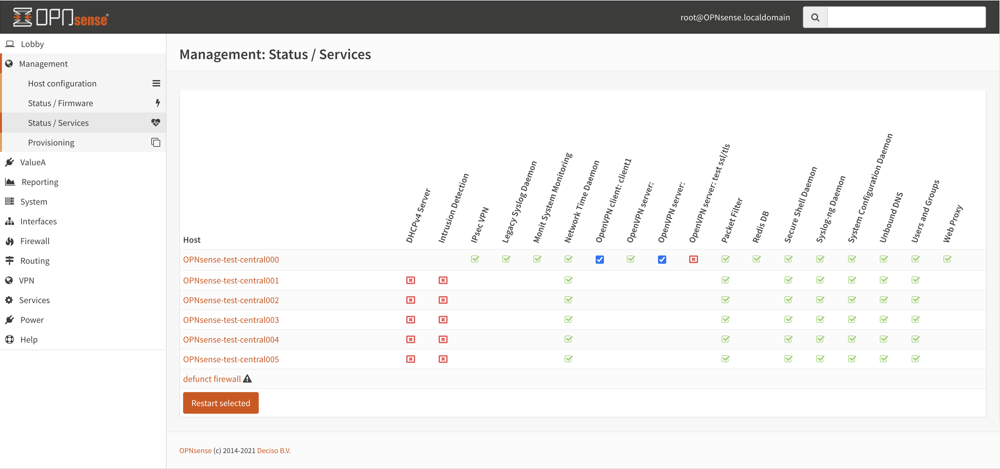

===================
Deciso: OPNcentral
===================

As part of the OPNsense Business Edition, Deciso offers a plugin to keep all your firewalls up to date and have
an easy entry point to manage them.

Installation
---------------------------

After acquiring a license, you can switch to the commercial software repository containing OPNcentral. In order to
install, just go to :menuselection:`System->Firmware->Plugins` and search for :code:`os-OPNcentral`.

Register new hosts
----------------------------

Before adding a host, you need to generate an API key and secret from the machine you will grant accesss to.
API keys are managed in the user manager (system_usermanager.php), go to the user manager page and select a user.
Somewhere down the page you will find the API section for this user.

Click on the + sign to add a new key. When the key is created, you will receive a (single download) with the credentials in one text file (ini formatted).
The contents of this file look like this:

.. code-block:: c

    key=w86XNZob/8Oq8aC5r0kbNarNtdpoQU781fyoeaOBQsBwkXUt
    secret=XeD26XVrJ5ilAc/EmglCRC+0j2e57tRsjHwFepOseySWLM53pJASeTA3

Next go to the Hosts section of the management menu in :menuselection:`Management->Hosts` and add a new host, copy
the url from the machine and the API key and secret generated above.

.. Note::

    You can disable certificate validation if your using a self-signed certificate, although we advise to generate proper
    certificates for the machines.

.. image:: images/OPNcentral_hosts.png
    :width: 100%

Connect to managed machine
----------------------------------

On various management pages there are direct links available to login to the firewall in question.
Usually connected nodes are shown with a link which opens in a new tab when clicking.

The example below shows a link in the firmware status page which will open :code:`https://node1.opnsense.local`.

.. image:: images/OPNcentral_status_uptodate.png
    :width: 100%

When the management server is allowed to access the OPNcentral components on the connected node it will automatically login
after the link is clicked with the proper credentials assigned to the api token user.

If the latests Business Edition is installed on the managed machine, but access prohibits automatic logins, you will be redirected to the login page.

When the connected machine is not using the business edition, it's not possible to use the link, a message such as the following will be presented to the
user:

.. image:: images/OPNcentral_auto_login_unavailable.png
    :width: 60%

.. Note::

    Make sure your browser trusts the remote node otherwise the browser can't access the machine and will signal an issue with the
    software version.

Machine firmware status / upgrade
----------------------------------------------------

All connected and enabled machines can be contacted using the  :menuselection:`Management->Status` page, when visiting the
page all connected machines will automatically be contacted to report their status and installed version.

.. image:: images/OPNcentral_status_toupdate.png
    :width: 100%

When an update is available, it will be shown in the list, including if this upgrade requires a reboot. The upgrade button starts
the upgrade procedure, but will only upgrade machines that will require a reboot if **Enable reboot** is checked.

.. Tip::

    .. raw:: html

         Use the refresh <i class="fa fa-refresh fa-fw"></i> button to request status again.

The upgrade wheel starts spinning when an upgrade was requested, since the upgrade itself can consume some time, you can revisit the
status page later (or press refresh) to show the new status.

Machine service status and control
----------------------------------------------------

The service status and control page provides an overview on all managed OPNsense firewalls connected to OPNcentral and
offers the ability to restart services when needed.

In the screenshot above there are 7 machines managed by OPNcentral, for every configured service there's an icon reflecting the
status of the service.

.. raw:: html

     <i class="fa fa-window-close-o text-danger" style="color:#F05050"></i> Stopped (inactive, but configured)  
     <i class="fa fa-check-square-o text-success" style="color:#9BD275"></i> Running (active)  
     <i class="fa fa-exclamation-triangle"></i> Host unreachable or misconfigured   

When you click one of the service icons, the icon changes into a checkbox which can be used to restart the selected
services with the button below the table.

.. Tip::

    The link in the host column brings you directly into the service control page of the selected firewall.

Provisioning / sharing settings
----------------------------------------------------

The provisioning tool offers the ability to configure some settings in a more centralised manner. Inspired by the functionality that
is offered for high-availability setups, you can distribute global settings among all connected firewalls for various configuration options.
The central host acts as a template in this case.

In order to configure the settings that should be shared, you can configure the "classes" to synchronize in the host settings :menuselection:`Management->Host configuration`.

Here you will find the same options as are available under :menuselection:`System->High Availability->Settings`.
After configuring the desired parameters, you can use the Provisioning page (:menuselection:`Management->Provisioning`) to
inspect status and push options to the attached firewalls.

.. Warning::

    Be **very** careful pushing settings to your connected firewall which may disconnect your session, such as firewall and routing related
    options. The central management host can't predict if settings you plan to make lead to an inaccesible firewall.

All provisioning classes known by the management machine will be shown in the table, combined with the status of each section.
OPNcentral calculates if settings are equal, keeps track of changes and restarts related services when needed.

.. image:: images/OPNcentral_provisioning_status.png
    :width: 100%

You can either selectlively reconfigure specific hosts with the checkbox or reconfigure all at once on command.

.. raw:: html

     <i class="fa fa-exchange text-success" style="color:#9BD275"></i> Class equals this machine (nothing todo)  
     <i class="fa fa-refresh"></i> Changes ready to commit  
     <i class="fa fa-question-circle"></i> Unknown yet configured class  
     <i class="fa fa-times text-danger" style="color:#F05050"></i> Unable to connect   

.. Tip::

      When users and groups are synchronized, the existing api key+secret is merged into the user with the same name to prevent access
      issues after reconfigure. To avoid issues, make sure there's a unique username with proper credentials before using
      the synchronization.

.. Note::

      Since various firewall sections depend on aliases, OPNcentral checks if aliases are used before removing local aliases
      from the remote firewall.
