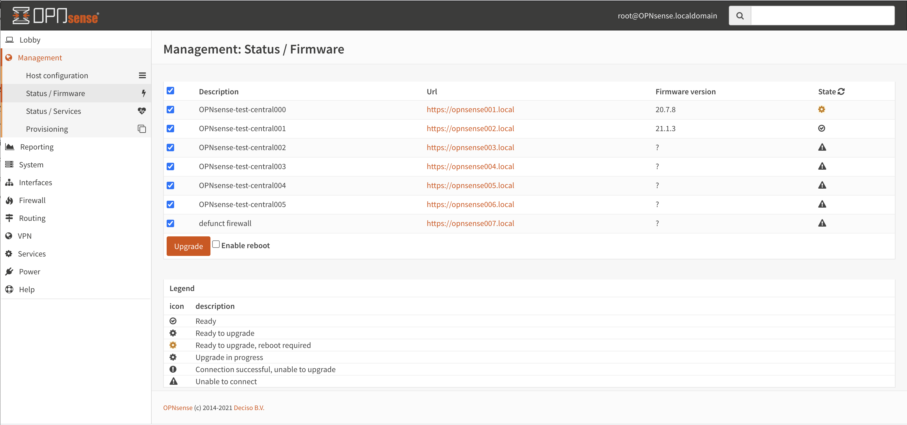
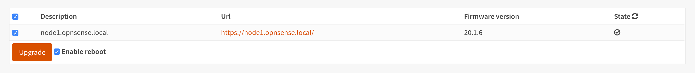

===================
Deciso: OPNcentral
===================

As part of the OPNsense Business Edition, Deciso offers a plugin to keep all your firewalls up to date and have
an easy entry point to manage them.

Installation
---------------------------

After acquiring a license, you can switch to the commercial software repository containing OPNcentral. In order to
install, just go to :menuselection:`System->Firmware->Plugins` and search for :code:`os-OPNcentral`.

Register new hosts
----------------------------

Before adding a host, you need to generate an API key and secret from the machine you will grant accesss to.
API keys are managed in the user manager (system_usermanager.php), go to the user manager page and select a user.
Somewhere down the page you will find the API section for this user.

Click on the + sign to add a new key. When the key is created, you will receive a (single download) with the credentials in one text file (ini formatted).
The contents of this file look like this:

.. code-block:: c

    key=w86XNZob/8Oq8aC5r0kbNarNtdpoQU781fyoeaOBQsBwkXUt
    secret=XeD26XVrJ5ilAc/EmglCRC+0j2e57tRsjHwFepOseySWLM53pJASeTA3

Next go to the Hosts section of the management menu in :menuselection:`Management->Hosts` and add a new host, copy
the url from the machine and the API key and secret generated above.

.. Note::

    You can disable certificate validation if your using a self-signed certificate, although we advise to generate proper
    certificates for the machines.

.. image:: images/OPNcentral_hosts.png
    :width: 100%

Machine status / upgrade
----------------------------

All connected and enabled machines can be contacted using the  :menuselection:`Management->Status` page, when visiting the
page all connected machines will automatically be contacted to report their status and installed version.

When an update is available, it will be shown in the list, including if this upgrade requires a reboot. The upgrade button starts
the upgrade procedure, but will only upgrade machines that will require a reboot if **Enable reboot** is checked.

.. Tip::

    .. raw:: html

         Use the refresh <i class="fa fa-refresh fa-fw"></i> button to request status again.

The upgrade wheel starts spinning when an upgrade was requested, since the upgrade itself can consume some time, you can revisit the
status page later (or press refresh) to show the new status.

Connect to managed machine
----------------------------------

Every connected node is shown with a link which opens in a new tab when clicking, in the example below that would be :code:`https://node1.opnsense.local`.

