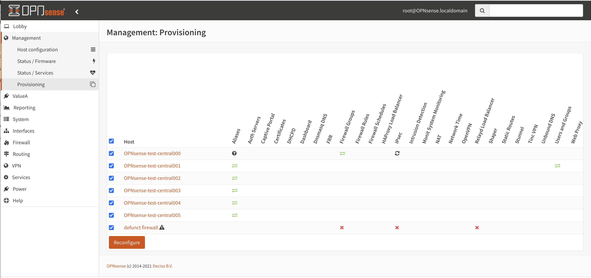

===================
Deciso: OPNcentral
===================

As part of the OPNsense Business Edition, Deciso offers a plugin to keep all your firewalls up to date and have
an easy entry point to manage them.

.. contents:: Index

Installation
---------------------------

After acquiring a license, you can switch to the commercial software repository containing OPNcentral. In order to
install, just go to :menuselection:`System->Firmware->Plugins` and search for :code:`os-OPNcentral`.

Register new hosts
----------------------------

Before adding a host, you need to generate an API key and secret from the machine you will grant accesss to.
API keys are managed in the user manager (system_usermanager.php), go to the user manager page and select a user.
Somewhere down the page you will find the API section for this user.

Click on the + sign to add a new key. When the key is created, you will receive a (single download) with the credentials in one text file (ini formatted).
The contents of this file look like this:

.. code-block:: c

    key=w86XNZob/8Oq8aC5r0kbNarNtdpoQU781fyoeaOBQsBwkXUt
    secret=XeD26XVrJ5ilAc/EmglCRC+0j2e57tRsjHwFepOseySWLM53pJASeTA3

Next go to the Hosts section of the management menu in :menuselection:`Management->Hosts` and add a new host, copy
the url from the machine and the API key and secret generated above.

.. Note::

    You can disable certificate validation if your using a self-signed certificate, although we advise to generate proper
    certificates for the machines.

.. image:: images/OPNcentral_hosts.png
    :width: 100%

.. raw:: html

     <strong>Icons</strong> 
     <i class="fa fa-fw fa-circle-o"></i> Group membership  
     <i class="fa fa-fw fa-archive"></i> Download configuration (or all as a zip file)   
     <i class="fa fa-fw fa-pencil"></i> Edit host configuration 
     <i class="fa fa-fw fa-clone"></i> Clone host configuration 
     <i class="fa fa-fw fa-trash-o"></i> Delete host configuration  

Central WebGui certificate management
......................................

The host configuration offers an option to link a central certificate to the managed host, in which case
the certificate will be distributed to the host (if :code:`WebGui` is being provisioned).

Using this feature, you're able to centrally manage certificates (manually or using ACME) easily.

.. Tip::

    Add :code:`OPNcentral - provision / reconfigure remote hosts` in :menuselection:`System --> Settings --> Cron`
    with a daily schedule to automatically provision all attached firewalls on a daily basis.

Alter generic host settings
..................................

The second tab in the screen contains the setting page which configures defaults for all hosts where applicable.

================================= ===============================================================================================================================================
 Option                            Description
================================= ===============================================================================================================================================
Interfaces                         Select the interfaces of the central node that would be used when merging settings on the remote firewall, only applicable on part of the
                                   configuration sections (such as the firewall). See the provisioning section for more details.
Enable backups                     Enable centralized backups.
#Backups to preserve               Number of backups to preserve per remote host on this machine
================================= ===============================================================================================================================================

Centralized backups
----------------------------

When "Enable backups" is checked in the generic host settings tab OPNcentral will perform a nighly backup of all configured
hosts. The host overview (:menuselection:`Management-->Host configuration`) shows the number of backups
with their related size and last modification date for each host.

.. Note::

    The modification date defines the last time the remote host was changed, so if a host hasn't been changed
    for a longer period of time this value would show an older date.

.. Tip::
    It is possible to execute the backup manually from the gui. In order to do that, go
    to :menuselection:`Management-->Host configuration` and press the :code:`Execute backup` button.

.. Tip::
    If more frequent backups are desired, just add a cron job in :menuselection:`System-->Settings-->Cron`
    for the task :code:`OPNcentral - backup remote hosts`.

Multi tenancy using host groups
----------------------------------

Hosts can be organised in groups using the :menuselection:`Management->Host groups` menu option.
By default hosts are accessible by all users having access to the specified OPNcentral menu options.
You can change that behaviour by linking a host into one or more groups, where you can constrain access.

.. blockdiag::
  :scale: 100%

    blockdiag {
        orientation = portrait
        default_fontsize = 9;

        host_group [shape = box, label="Host group"];
        host [shape = box, label="Host"];
        user_group [shape = box, label="User group"];

        host_group -> host;
        user_group -> host_group [style = dotted];

    }

.. Warning::

      When attaching a host to multiple host groups and want to constraint access, make sure you limit all host groups
      to avoid accidental access for all OPNcentral users.

Connect to managed machine
----------------------------------

On various management pages there are direct links available to login to the firewall in question.
Usually connected nodes are shown with a link which opens in a new tab when clicking.

The example below shows a link in the firmware status page which will open :code:`https://node1.opnsense.local`.

.. image:: images/OPNcentral_status_uptodate.png
    :width: 100%

When the management server is allowed to access the OPNcentral components on the connected node it will automatically login
after the link is clicked with the proper credentials assigned to the api token user.

If the latests Business Edition is installed on the managed machine, but access prohibits automatic logins, you will be redirected to the login page.

When the connected machine is not using the business edition, it's not possible to use the link, a message such as the following will be presented to the
user:

.. image:: images/OPNcentral_auto_login_unavailable.png
    :width: 60%

.. Note::

    Make sure your browser trusts the remote node otherwise the browser can't access the machine and will signal an issue with the
    software version.

Machine firmware status / upgrade
----------------------------------------------------

All connected and enabled machines can be contacted using the  :menuselection:`Management->Status` page, when visiting the
page all connected machines will automatically be contacted to report their status and installed version.

.. image:: images/OPNcentral_status_toupdate.png
    :width: 100%

When an update is available, it will be shown in the list, including if this upgrade requires a reboot. The upgrade button starts
the upgrade procedure, but will only upgrade machines that will require a reboot if **Enable reboot** is checked.

.. Tip::

    .. raw:: html

         Use the refresh <i class="fa fa-refresh fa-fw"></i> button to request status again.

The upgrade wheel starts spinning when an upgrade was requested, since the upgrade itself can consume some time, you can revisit the
status page later (or press refresh) to show the new status.

Machine service status and control
----------------------------------------------------

The service status and control page provides an overview on all managed OPNsense firewalls connected to OPNcentral and
offers the ability to restart services when needed.

.. image:: images/OPNcentral_service_status_overview.png
    :width: 100%

In the screenshot above there are 7 machines managed by OPNcentral, for every configured service there's an icon reflecting the
status of the service.

.. raw:: html

     <i class="fa fa-window-close-o text-danger" style="color:#F05050"></i> Stopped (inactive, but configured)  
     <i class="fa fa-check-square-o text-success" style="color:#9BD275"></i> Running (active)  
     <i class="fa fa-exclamation-triangle"></i> Host unreachable or misconfigured   

When you click one of the service icons, the icon changes into a checkbox which can be used to restart the selected
services with the button below the table.

.. Tip::

    The link in the host column brings you directly into the service control page of the selected firewall.

Machine resource status
----------------------------------------------------

In order to gain insights into the managed machines there is a resource page available which queries all connected
firewalls and reports aggregated status about them.

While collecting data for a machine there's a spinner visible, as soon as information is collected you can view
relevant information per node.

From left to right the following information is available:

* Host information

  *  Host name (description)
  *  Version installed
  *  Processor type
  *  Most recent configuration change (tooltip uncovers who made the change and from which module)

* General statistics

  * Current cpu usage (total percentage)
  * Total memory usage
  * Swap file usage
  * Total interfaces configured (up/down)
  * Aggregated HA status (when configured), MASTER when all interfaces are, BACKUP when at least one is demoted to BACKUP
  * Root file system usage
  * Gateway status including maximum delay

* Firewall

  * State table usage
  * Alias usage (when over 100% the requested entries don't fir in memory)
  * Source tracking table usage
  * Current traffic in/out, tooltip the piechart to show protocol name (or number) with current rate

.. Tip::

    When headings are underlined, a click brings you to the relevant module of the firewall in question.

Provisioning / sharing settings
----------------------------------------------------

The provisioning tool offers the ability to configure some settings in a more centralised manner. Inspired by the functionality that
is offered for high-availability setups, you can distribute global settings among all connected firewalls for various configuration options.
The central host acts as a template in this case.

In order to configure the settings that should be shared, you can configure the "classes" to synchronize in the host settings :menuselection:`Management->Host configuration`.

.. image:: images/OPNcentral_provisioning_host_classes_setup.png
    :width: 50%

Here you will find the same options as are available under :menuselection:`System->High Availability->Settings`.
After configuring the desired parameters, you can use the Provisioning page (:menuselection:`Management->Provisioning`) to
inspect status and push options to the attached firewalls.

.. Warning::

    Be **very** careful pushing settings to your connected firewall which may disconnect your session, such as firewall and routing related
    options. The central management host can't predict if settings you plan to make lead to an inaccesible firewall.

.. Tip::

    Add :code:`OPNcentral - provision / reconfigure remote hosts` in :menuselection:`System --> Settings --> Cron`
    with a daily schedule to automatically provision all attached firewalls on a daily basis.

All provisioning classes known by the management machine will be shown in the table, combined with the status of each section.
OPNcentral calculates if settings are equal, keeps track of changes and restarts related services when needed.

You can either selectlively reconfigure specific hosts with the checkbox or reconfigure all at once on command.

.. raw:: html

     <i class="fa fa-exchange text-success" style="color:#9BD275"></i> Class equals this machine (nothing todo)  
     <i class="fa fa-refresh"></i> Changes ready to commit  
     <i class="fa fa-question-circle"></i> Unknown yet configured class  
     <i class="fa fa-times text-danger" style="color:#F05050"></i> Unable to connect   

Provisioning classes
----------------------------------------------------

By default merging configuration items from the central firewall overwrites the settings on the target machine, but in some
cases we need a more practical approach to deal with local modifications.

In this chapter we are going to describe how classes with special implemenations are being treated on synchronisation and
how to utilise this behaviour to ease management.

Users & Groups
....................................................

When users and groups are synchronized, the existing api key+secret is merged into the user with the same name to prevent access
issues after reconfigure. To avoid issues, make sure there's a unique username with proper credentials before using
the synchronization.

.. Note::

    Although quite some setups will likely use external authentication options available in OPNsense, sometimes it's practical
    to share the same user database among different firewalls. This option allows for sharing, without the need to
    sue the same key+secret on all connected firewalls.

Aliases (Firewall)
....................................................

Since various firewall sections depend on aliases, OPNcentral checks if aliases are used before removing local aliases
from the remote firewall.

Due to this powerful feature, after synchronisation of the central aliases you can also use nesting to combine remote aliases
into new local ones.

For example, when the local machine has :code:`local_alias_1` and the central location offers :code:`central_alias_1`
when both are combined into :code:`local_alias_2` and :code:`local_alias_2` is used in firewall/nat rules it will
automatically merge central changes after a reconfigure action from the dashboard.

.. blockdiag::
   :desctable:

   blockdiag {
      local_alias_1 [label="'local'\nlocal_alias_1"];
      central_alias_1 [label="'central'\ncentral_alias_1"];
      local_alias_2 [label="'merged'\nlocal_alias_2"];
      local_alias_1 -> local_alias_2 [label="in"]
      central_alias_1 -> local_alias_2 [label="in"];
   }

.. Note::

    As long as :code:`local_alias_2` is used, both :code:`local_alias_1` and :code:`local_alias_2` will be preserved after provisioning.

Firewall rules
....................................................

Merging the firewall rules will keep the interfaces unaltered which don't exists on the central node as these are being provided to
the target firewall. In case you want to exclude some interfaces (for all remote firewalls), you can easily override the
known interfaces in :menuselection:`Management -> Host configuration` on the General settings tab.

Since there's an explicit order in which different types of rules are being handled, you can choose if you want to prefer
central rules being matched first or last depending on the type of "interface" to use.

.. blockdiag::
   :desctable:

   blockdiag {
      System [label="System defined", style = dotted];
      Floating [label="Floating rules"];
      Groups [label="Interface groups"];
      Interfaces [label="Interfaces"];
      System -> Floating -> Groups -> Interfaces;
   }

.. Tip::

    When forcing interface groups to the backup node, these will precede interface rules such as LAN and WAN, when only sending
    over interface groups the remote firewall is able to allow traffic which would otherwise be rejected.

.. Note::

    When multiple interfaces are attached to a (floating) rule, these will be removed by the provisioning algorithm as
    the intend isn't fully clear in these matters.

.. Note::

    Rules on the central node which do apply to all interfaces or a selection of interfaces are always being send to the remote
    firewall. When this isn't intentional, best not use these options in the "floating" rules.

NAT (Firewall)
....................................................

Merging the nat rules will keep the interfaces unaltered which don't exists on the central node as these are being provided to
the target firewall. In case you want to exclude some interfaces (for all remote firewalls), you can easily override the
known interfaces in :menuselection:`Management -> Host configuration` on the General settings tab.

.. Note::

    All NAT type rules (:code:`Port Forward`, :code:`One-to-One`, :code:`Outbound`, :code:`NPTv6`) are treated similar.

.. Note::

    When multiple interfaces are attached to a rule, which is possible for port forwards.  These will be removed by the provisioning algorithm.

.. Note::

    Port forwarding rules on the central node which do apply on a selection of interfaces are always being send to the remote
    firewall. When this isn't intentional, best prevent the usage of these forwards.

Firewall categories
....................................................

Merging categories will preserve the ones that are currently used on the remote firewall.

WebGui (Administration)
....................................................

To prevent breakage after synchronisation, the certificate used by the webgui will be preserved after synchronisation
(or the one provided in the host configuration will be shipped).

.. Note:

    Currently it's not possible to merge certificates and webgui admin settings, as the certificate store will potentially
    be overwritten in that case.
