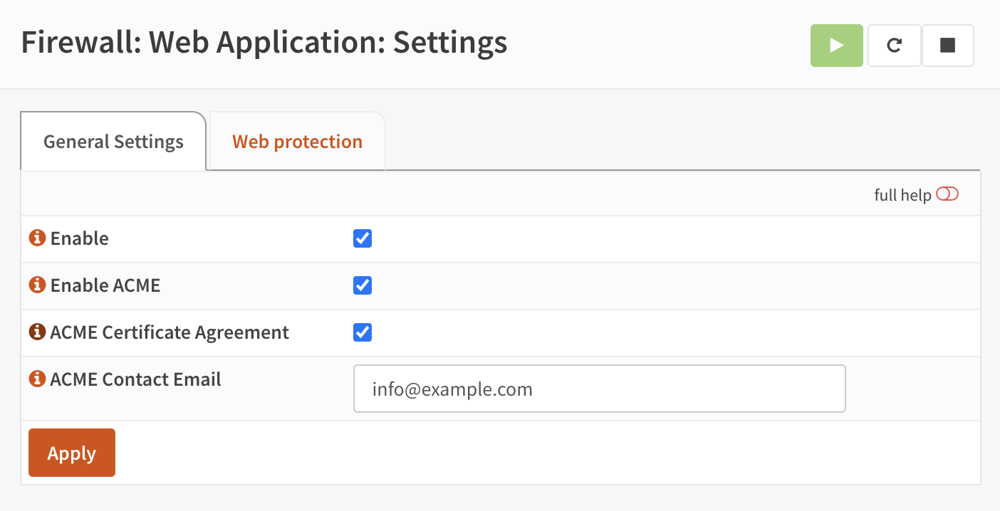
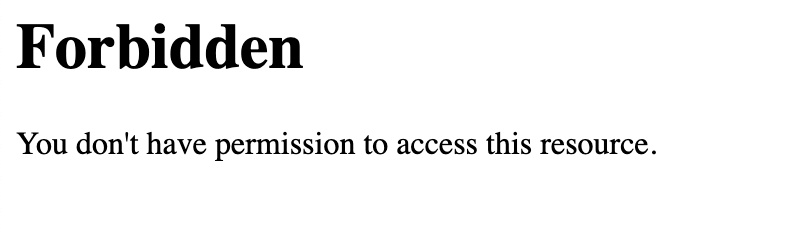

======================================
Deciso: Web Application Firewall
======================================

As part of the OPNsense Business Edition, Deciso offers a plugin to easily protect webservices against all sort
of injection attacks and provides encryption for traffic to and from the outside world.

Our Web Application Firewall plugin offers some functionality which can also be found in community plugins available,
but in a more user friendly manor. It combines the features most commonly used in `reverse proxies <https://en.wikipedia.org/wiki/Reverse_proxy>`__,
such as TLS offloading and load balancing.

To ease maintenance the :code:`OPNWAF` plugin offers usage of both internal certificates or newly generated
using the ACME protocol via `Let's Encrypt <https://letsencrypt.org/>`__ with a single click.

Prerequisites
---------------------------

Before using this plugin in combination with Let's Encrypt, make sure port 443 isn't being used for the
web gui of this firewall (:menuselection:`System->Settings->Administration`).

.. Note::

    The Web Application Firewall uses `tls-alpn-01` for easy domain verification, this requires the server to listen on port 443.

Installation
---------------------------

To install this plugin, go to :menuselection:`System --> Firmware --> Plugins` and search for **os-OPNWAF**,
the [+] button downloads and installs the software.

Next go to :menuselection:`Firewall --> Web Application --> Settings` to enable it.

General
---------------------------

Before deep diving into the settings pages, we will explain the most important terminology used in this module.

Virtual servers
.........................

A virtual server (also known as a virtual host) is a a concept which allows the use of multiple domains on a single webserver using
the same port.
In our case it offers the possibility to host various webservers inside your network and forward traffic to them in a secure fashion.

Locations
.........................

Locations reside in virtual servers and describe on a path level how requests are being handled, if for example one would
like to forward only a subdirectory (like :code:`/api`) to a server in the network, the location is where to configure this.

Web protection
.........................

The web protection options offer easy access to the `OWASP ModSecurity ruleset <https://owasp.org/www-project-modsecurity-core-rule-set/>`__
, which offers a set of generic attack detection rules against a wide range attacks including the `OWASP Top Ten <https://owasp.org/www-project-top-ten/>`__.

Setup
---------------------------

Before configuring virtual servers, let's take a look at the general settings pages (:menuselection:`Firewall --> Web Application --> Settings`).
After installation, the module itself should be enabled by default.

In order to use the integrated ACME client (for Let's Encrypt), the ACME enable checkbox needs to be set, the certificate agreement needs to be accepted
(next checkbox) and contact email needs to be specified.

Web protection is not enabled by default, but you can enable it in the `Web protection` tab. This is also the place
to configure the module and settings which apply for all virtual hosts.

Configure virtual hosts
---------------------------

With the general settings in place, we can start adding virtual servers to offload traffic to machines in our network.
First go to :menuselection:`Firewall --> Web Application --> Gateways` and click on the [+] in the top section of the screen,
which defines the virtual servers.

=========================================================================================================================

================================ ========================================================================================
Enabled                          Enable this virtual server
ServerName                       Fully qualified hostname for this server
Port                             Port number this vhost will listen on, can easily be combined with firewall nat rules
                                 to map traffic to non standard ports when origination from remote destinations.
                                 (e.g. listen 8443 on, forward 443 to 8443)
Certificate                      When using a certificate available in the system trust store, select it here
CA for client auth               Require a client certificate signed by the provided authority before allowing
                                 a connection.
CRL for client auth              Attach the (first) found certificate revocation list for the selected CA to
                                 this virtual host. Please note when no CRL is offered all clients are rejected.
Enable ACME                      Enable the ACME protocol to automatically provision certificates using Let's Encrypt,
                                 when set will ignore the selected certificate (and enable SSL on this virtual server)
Header Security                  Header security, by default several privacy and security related headers are set,
                                 in some cases (old applications for example) you might want to disable
                                 sending default headers to clients.
TLS Security profile             TLS security profile as documented by
                                 `Mozilla <https://wiki.mozilla.org/Security/Server_Side_TLS>`__
Description                      User friendly description for this vhost
================================ ========================================================================================

This section defines the port the virtual server will listen on, remember, in order to use ACME (Let's encrypt) this should either
be 443 or the traffic should be forwarded from port 443 to the port defined here.

.. Note::

    Port numbers don't have to be unique when more virtual servers are defined as the hostname correctly identifies the
    location.

When supplying a certificate manually via the system trust store you can assign it in this dialog as well.

The virtual server itself doesn't provide much content to the user other than offering a page telling access is prohibited,
so the next step is to map directories to external locations. These can be defined in the "Locations" Grid underneath
the Virtual servers.

=========================================================================================================================

================================ ========================================================================================
Enabled                          Enable this location
Path                             Local path to match
Remote destinations              Locations to forward requests to, when more than one is provided, requests will be
                                 loadbalanced in a round robin fashion.
Access control                   List of networks allowed to access this path (empty means any)
VirtualServer                    The server this location belongs to
Description                      User friendly description for this location
================================ ========================================================================================

The options here are quite simple, first you define a path on your end (:code:`/` in our example), next you define one or more
destinations this path should map to (for example you could point to a public server here, like https://opnsense.org).

.. Note::

    When more than one destination is provided, the load will be balanced automatically.

.. Tip::

    Constraining access to allow only specific networks or hosts can be arranged using the :code:`Access control` input.

Test web protection
---------------------------

When web protection was enabled, we always advise to test if it's actually functional. Luckily this is quite easy to test
using a webbrowser. For this example we will try to inject some sql code in the url, which should be blocked when properly configured:

:code:`https://your.example.domain/?id=100 or 'x'='y'`

This should show a page similar to the one below:

.. Tip::

    You can disable web protection on a per virtual host bases to, just open the advanced settings and click :code:`Disable Web Protection`,
    apply settings after saving and try the previous example again.

Protect a local server with certificates
-------------------------------------------------

In the above virtual host configuration there are a couple of parameters related to client authentication. The
advantage of using these is that you can prevent unauthorized access to services using certificates signed by a (local)
certificate authority.

To use this functionality, first make sure you have a certificate authority defined in :menuselection:`System --> Trust --> Authorities`
which you are going to use to create certificates for your clients.

Next step is to add a VirtualServer which contains at least the following information:

=========================================================================================================================

================================ ========================================================================================
ServerName                       The fully qualified domain name this host listens to
Port                             Port number to bind to, you can use :doc:`Port forwarding </manual/nat>`
                                 to redirect traffic from standard ports to non standard ones when needed
Certificate / Enable ACME        Either use an ACME certificate or define one yourself,
                                 this one should be trusted by the browser connecting to this host
CA for client auth               select the Authority created earlier
================================ ========================================================================================

Followed by a location, which maybe as simple as binding path :code:`/` to a local machine without certificate at :code:`http://10.0.0.1`.

.. Tip::

    You can use revocation lists to pull back access rights for selected clients, just make sure to restart the service in
    order to make the changes effective.

After this step, clients should not be able to access the virtual host, next you can create a certificate for the client and import
it in the trust store. Usually browsers automatically pick these up when allowed by the client.
