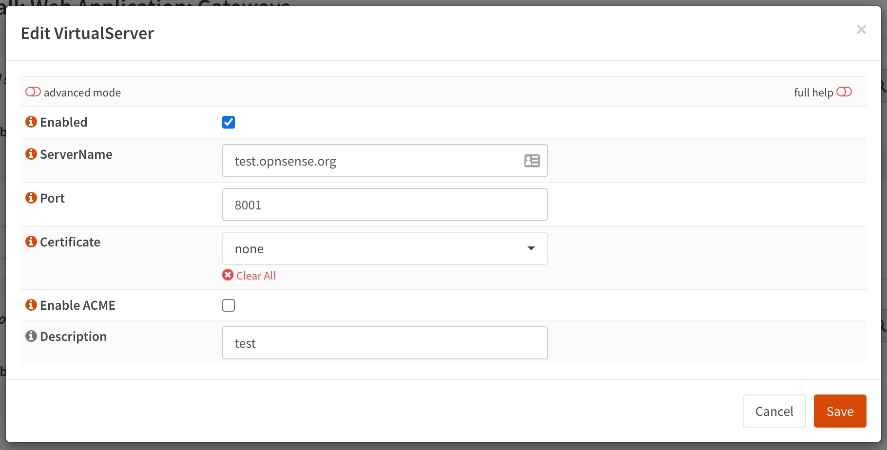
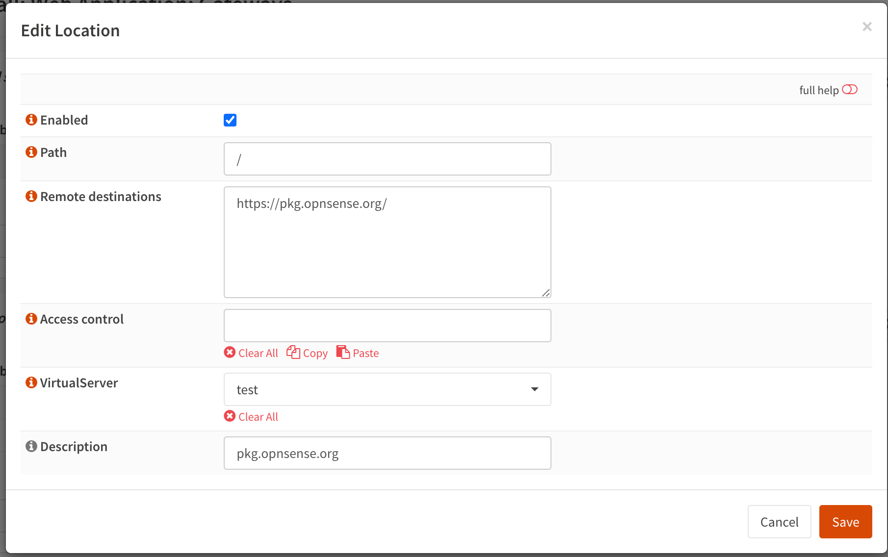

======================================
Deciso: Web Application Firewall
======================================

As part of the OPNsense Business Edition, Deciso offers a plugin to easily protect webservices against all sort
of injection attacks and provides encryption for traffic to and from the outside world.

Our Web Application Firewall plugin offers some functionality which can also be found in community plugins available,
but in a more user friendly manor. It combines the features most commonly used in `reverse proxies <https://en.wikipedia.org/wiki/Reverse_proxy>`__,
such as TLS offloading and load balancing.

To ease maintenance the :code:`OPNWAF` plugin offers usage of both internal certificates or newly generated
using the ACME protocol via `Let's Encrypt <https://letsencrypt.org/>`__ with a single click.

Prerequisites
---------------------------

Before using this plugin in combination with Let's Encrypt, make sure port 443 isn't being used for the
web gui of this firewall (:menuselection:`System->Settings->Administration`).

.. Note::

    The Web Application Firewall uses `tls-alpn-01` for easy domain verification, this requires the server to listen on port 443.

Installation
---------------------------

To install this plugin, go to :menuselection:`System --> Firmware --> Plugins` and search for **os-OPNWAF**,
the [+] button downloads and installs the software.

Next go to :menuselection:`Firewall --> Web Application --> Settings` to enable it.

General
---------------------------

Before deep diving into the settings pages, we will explain the most important terminology used in this module.

Virtual servers
.........................

A virtual server (also known as a virtual host) is a a concept which allows the use of multiple domains on a single webserver using
the same port.
In our case it offers the possibility to host various webservers inside your network and forward traffic to them in a secure fashion.

Locations
.........................

Locations reside in virtual servers and describe on a path level how requests are being handled, if for example one would
like to forward only a subdirectory (like :code:`/api`) to a server in the network, the location is where to configure this.

Web protection
.........................

The web protection options offer easy access to the `OWASP ModSecurity ruleset <https://owasp.org/www-project-modsecurity-core-rule-set/>`__
, which offers a set of generic attack detection rules against a wide range attacks including the `OWASP Top Ten <https://owasp.org/www-project-top-ten/>`__.

Setup
---------------------------

Before configuring virtual servers, let's take a look at the general settings pages (:menuselection:`Firewall --> Web Application --> Settings`).
After installation, the module itself should be enabled by default.

In order to use the integrated ACME client (for Let's Encrypt), the ACME enable checkbox needs to be set, the certificate agreement needs to be accepted
(next checkbox) and contact email needs to be specified.

.. image:: images/OPNWAF_settings.png
    :width: 100%

Web protection is not enabled by default, but you can enable it in the `Web protection` tab. This is also the place
to configure the module and settings which apply for all virtual hosts.

Configure virtual hosts
---------------------------

With the general settings in place, we can start adding virtual servers to offload traffic to machines in our network.
First go to :menuselection:`Firewall --> Web Application --> Gateways` and click on the [+] in the top section of the screen,
which defines the virtual servers.

This section defines the port the virtual server will listen on, remember, in order to use ACME (Let's encrypt) this should either
be 443 or the traffic should be forwarded from port 443 to the port defined here.

.. Note::

    Port numbers don't have to be unique when more virtual servers are defined as the hostname correctly identifies the
    location.

When supplying a certificate manually via the system trust store you can assign it in this dialog as well.

The virtual server itself doesn't provide much content to the user other than offering a page telling access is prohibited,
so the next step is to map directories to external locations. These can be defined in the "Locations" Grid underneath
the Virtual servers.

The options here are quite simple, first you define a path on your end (:code:`/` in our example), next you define one or more
destinations this path should map to (as example we're pointing to a public server here).

.. Note::

    When more than one destination is provided, the load will be balanced automatically.

.. Tip::

    Constraining access to allow only specific networks or hosts can be arranged using the :code:`Access control` input.

Test web protection
---------------------------

When web protection was enabled, we always advise to test if it's actually functional. Luckily this is quite easy to test
using a webbrowser. For this example we will try to inject some sql code in the url, which should be blocked when properly configured:

:code:`https://your.example.domain/?id=100 or 'x'='y'`

This should show a page similar to the one below:

.. image:: images/OPNWAF_forbidden.png
    :width: 50%

.. Tip::

    You can disable web protection on a per virtual host bases to, just open the advanced settings and click :code:`Disable Web Protection`,
    apply settings after saving and try the previous example again.
