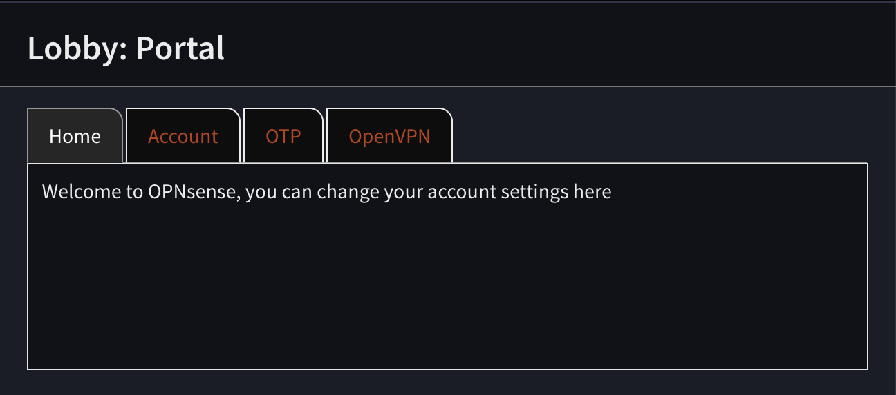

======================================
User Portal
======================================

Preperation
---------------------------

In order to effectively use this module, make sure to allow users to login to OPNsense using a username and password
when they are on the local network.

General
---------------------------

The portal replaces the simple user password menu, which can be found at :menuselection:`Lobby --> Password` and
offers additional functionality for self-service support.

Depending on the configuration users are able to change their password and language here, download and re-generate one time
password tokens and access OpenVPN profiles for the instances they have access too.

.. Note::

    The visible tabs depend on access rights configured in the administration part.

Administration
---------------------------

Under :menuselection:`System: Settings: Portal Admin` you will find the administration part of the portal, this
includes generic account settings and OpenVPN instance access.

Settings
~~~~~~~~~~~~~~~~~~~~~~~~~~~

Here you will find the basic settings for the portal

================================ ========================================================================================
Option                           Description
================================ ========================================================================================
Allow OTP token creation         Select which group a user should be a member of to manage it's own token
User portal welcome message      Welcome message (first tab content), may include html formatted text.
================================ ========================================================================================

OpenVPN
~~~~~~~~~~~~~~~~~~~~~~~~~~~

The OpenVPN tab shows a grid where you can add instances which a user should have access to, it contains most of the
settings also available in the standard OpenVPN export module.

================================ ========================================================================================
Option                           Description
================================ ========================================================================================
Member of                        Select which group a user should be a member of to download a profile
Server instance                  The instance we grant access to
Certificate lifetime (days)      Lifetime of a certificate, after expiry the user can not login anymore
Certificate Key type             Type of certificate to include in the profile
Certificate Digest Algorithm     Digest algoritm used to generate the certificate
Export template                  Type of file the user will download
Hostname                         The hostname or ip address used to contact this firewall
Description                      Description shown to the user for this instance download
================================ ========================================================================================

.. Tip::

    If a user should be allowed to download multiple file formats for the same service, you can duplicate
    the entry.

