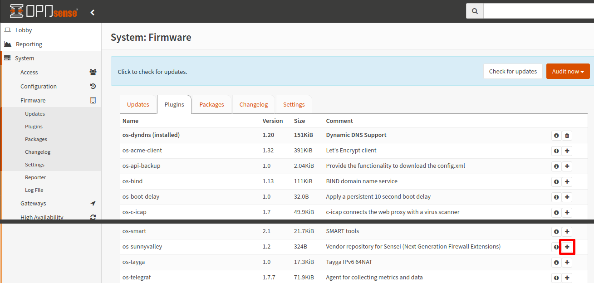
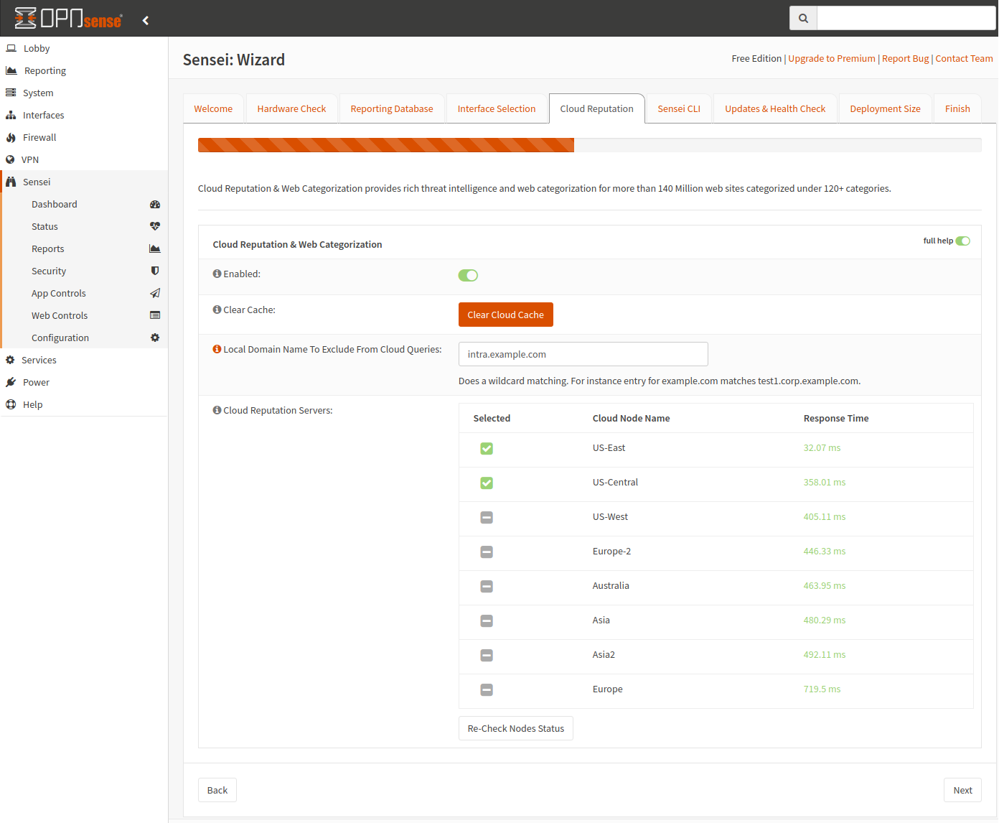
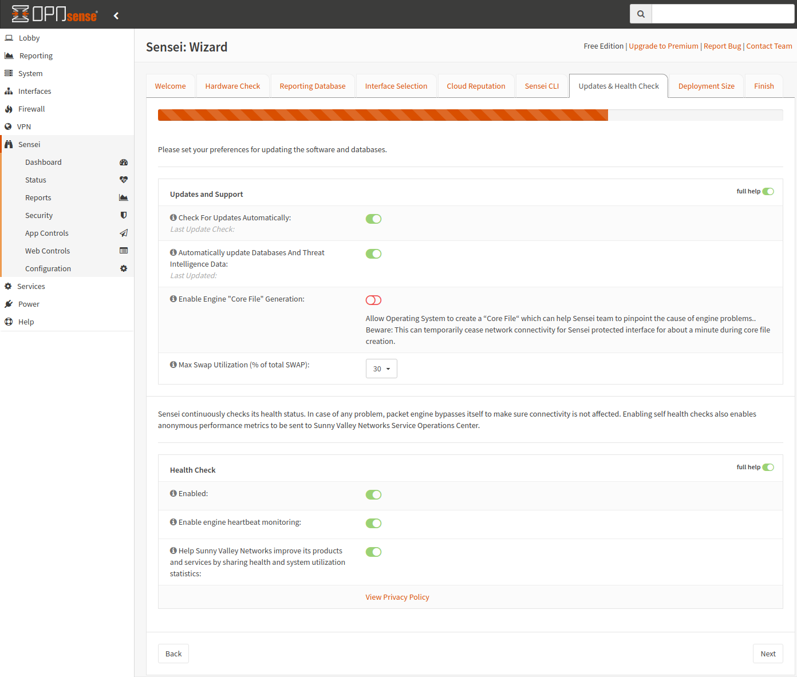
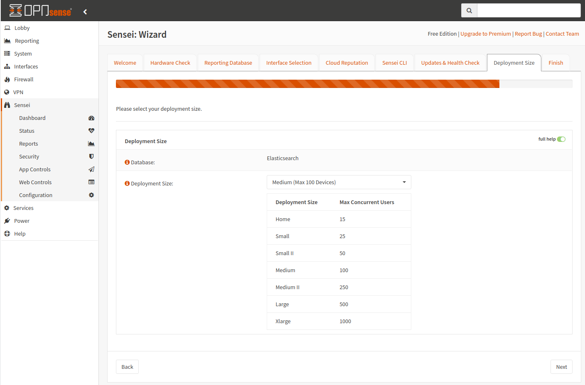

=====================
Sensei: Installing
=====================

.. Note::

    Sensei Free Edition is **forever free-of-charge**. We strongly recommend you register to keep in touch with updates and new features. You can register at `https://www.sunnyvalley.io/sensei <https://www.sunnyvalley.io/sensei>`_

Sensei may be installed using the web interface in OPNsense or using the command line interface via SSH or direct system access. The preferred method is the web interface. Once Sensei is installed, you will need to complete the initial configuration in the web interface so it is convenient to also complete the installation using the web interface.

To install plugins in OPNsense, you must use an account with administrative access.

.. Note::

    Before installing Sensei, you should ensure you meet the minimum system requirements in order to run Sensei or to have the best user experience. See :doc:`sensei_hardwarerequirements` for more information.

-----------------------------

Web Interface Installation (Preferred Method)
-----------------------------

To install Sensei, you must first install the Sunny Valley Networks vendor repository plugin. Go to the :menuselection:`System --> Firmware --> Plugins` page. Click on the “+” icon next to os-sunnyvalley to install the plugin. 

Once the vendor plugin is installed, you should see the Sensei plugin available in the list of plugins as os-sensei. If you do not see the plugin, you may need to refresh the Plugins page. Click the “+” icon next to os-sensei to install the plugin.

After installing Sensei, you should see the Sensei menu in the left sidebar of the OPNsense web interface. If you do not see the new, top-level menu, you may need to refresh your page.

.. image:: images/sensei-install-complete.png
    :width: 100%

-----------------------------

Command Line Installation (Alternative Method)
-----------------------------

The command line installation method was the primary means for installing Sensei before it was available on the “Plugins” page in the OPNsense web interface. This option is still available for users who have direct access to the OPNsense system yet prefer using command line tools or who may only have remote shell access via SSH to administrate their OPNsense installations. However, the web interface will need utilized after installation to complete the initial configuration of Sensei.

.. Tip:: 

    If you plan to leave the SSH service active, the best practice recommendations are to create a user with administrative access rather than using the “root” user and to make use of stronger authentication methods such as using keys rather than passwords.

-----------------------------

Direct System Access
-----------------------------

When you have direct access to OPNsense, you may simply log into OPNsense using the “root” user or another administrator account. You should see a list of OPNsense menu options.

.. image:: images/sensei-direct-system-access.png
    :width: 100%

-----------------------------

SSH Access
-----------------------------

If you only have shell access to OPNsense, you may install Sensei remotely by logging into OPNsense using a SSH client using the following command where “root” is the administrator account and “your-firewall-ip” is the IP address or hostname of the OPNsense system. You should see the same list of menu options as directly accessing the system.

.. code-block:: bash

    $ ssh root@your-firewall-ip

.. image:: images/sensei-ssh-login.png
    :width: 100%

-----------------------------

Download & Run Sensei Installer
--------------------------------

Once you are successfully logged into OPNsense either by direct system access or SSH access, enter option “8” to open the shell. Run the following command to download and execute the installation script.

.. code-block:: bash

    # curl https://updates.sunnyvalley.io/getsensei | sh

.. image:: images/sensei-cli-install.png
    :width: 100%

The script will copy the installation files onto the filesystem and will add a top-level menu item within the OPNsense web interface. Depending on the speed of your hardware and Internet connection, the installation may take several minutes to complete.

Once the installation has been completed, you may disconnect from your terminal session. You may also disable your firewall’s SSH service by unchecking the checkboxes mentioned above if you no longer wish to use the SSH service.

-----------------------------

Initial Configuration Wizard
------------------------------
Regardless of your installation method, you will need to go through the initial configuration wizard before you may start using Sensei.

To start the "Initial Configuration Wizard":

* Log in to your OPNsense web interface
* Click Sensei from the left menu
* Click on the Dashboard sub-menu to open the configuration wizard

------------
**1- EULA**
------------

* Accept the End User License Agreement *(scroll and read the terms to get to the next button)*.

.. image:: images/sensei-wizard-welcome.png
    :width: 100%

* Click the :menuselection:`I Agree` button to continue to the :menuselection:`Interface Selection` section.

-----------------------------
**2- Hardware Check**
-----------------------------

Your hardware will be analyzed to ensure it meets the minimum requirements. You will receive one of following responses: compatible hardware, low-end hardware, incompatible hardware. The setup will not continue if you have incompatible hardware.

.. image:: images/sensei-hardware-high-end.png
    :width: 100%

Compatible

.. image:: images/sensei-hardware-low-end.png
    :width: 100%

Low-end

.. image:: images/sensei-hardware-incompatible.png
    :width: 100%

Incompatible

* Click :menuselection:`Next` to continue to the :menuselection:`Reporting Database` section.

-----------------------------
**3- Reporting Database**
-----------------------------

* Select the database you wish to use for reporting. High end systems will have 3 options, while low end systems only have 2 options.

.. Warning::

    If you wish to use a remote ElasticSearch database, you must choose it now since you cannot change this after the initial configuration wizard has been completed. 

.. image:: images/sensei-reporting-database-high-end.png
    :width: 100%

High-end

.. image:: images/sensei-reporting-database-low-end.png
    :width: 100%

Low-end

* If you select “Use a Remote Elasticsearch Database”, you will be prompted to enter the URL, username, and password.

.. Note::

    If you have SOHO or higher Sensei paid subscription, we recommend that you install your license key before proceeding with the initial configuration wizard since this will activate a feature that will enable you to have central reporting for many firewalls from a single Elasticsearch instance. Otherwise, only a single remote ES instance can be used with a single firewall.

.. image:: images/sensei-reporting-database-remote.png
    :width: 100%

* Click the :menuselection:`Install Database & Proceed` button to install the local database if one is chosen and continue to the :menuselection:`Interface Selection` section.

-----------------------------
**4- Interface Selection**
-----------------------------

* Select the Ethernet Interface(s) to protect. To do so, click on an interface and use the right/left arrow buttons to move it to protected/unprotected interfaces combo box.

.. image:: images/sensei-interface-selection-available.png
    :width: 100%

.. image:: images/sensei-interface-selection-protected.png
    :width: 100%

* Click :menuselection:`Next` to continue to the :menuselection:`Cloud Reputation`section.

--------------------------
**3- Cloud Reputation**
--------------------------

The Cloud Threat Intelligence data is queried in real-time when any connections are made through your network. This capability enables Sensei to respond to malware and wireless outbreaks in real-time and very quickly.

The engine processes the request, queries the **“Sunny Valley Network (SVN) Cloud”** in real-time, and decides whether it will be blocked or allowed. Sensei checks against 140+ million websites under 120+ categories in milliseconds.

Cloud Threat Intel settings let you:

* Enable/Disable the “Cloud Reputation & Web Categorization” engine
* Set local domain name you wish to be excluded from cloud queries
* Select the fastest Cloud Reputation Servers which are used for queries

* Click :menuselection:`Next` to continue to the :menuselection:`Sensei CLI` section.

--------------------------------
**4- Sensei CLI (Security)**
--------------------------------

* Set your TCP Service password. This password protects the command line access to the packet engine. It is highly recommended to use a very secure password. The default password is “Sensei1234” so be sure to change it.

.. image:: images/sensei-wizard-sensei-cli.png
    :width: 100%

* Click :menuselection:`Next` to continue to the :menuselection:`Updates & Health Check` section.

-------------------------------
**5- Updates & Health Check**
-------------------------------

.. Note::

    Sensei uses the OPNsense package system to deliver its updates. You may configure how you prefer to receive your Sensei updates.

* **Check for Updates Automatically:** Checks automatically for the updates and creates a notification on the Sensei “Status” page.
* **Automatically Update Databases and Threat Intelligence Data:** Checks automatically for the updates and creates a notification on the Sensei “Status” page.
* **Enable Generation of Support Data:** If enabled, Sensei collects supporting data during unusual events and crashes. You can share this data when opening a ticket with us.
* **Max Swap Utilization:** You may specify how much swap space Sensei may utilize when the system is low on memory. It is recommended that you do not set this value too high. Otherwise, system performance may suffer.
* **Health Check:** If enabled, "Health Check" monitors the system's memory, CPU, disk usage and core services if they're working correctly, and raises alerts if anything goes wrong. "Health Check" also stops the appropriate services if they're consuming excessive system resources.
* **Help Sunny Valley Improve Its Products and Services:** If enabled, general system information is submitted to Sunny Valley to help improve the future development of Sensei.

* Click :menuselection:`Next` to continue to the :menuselection:`Deployment Size` section.

--------------------------
**6- Deployment Size**
--------------------------

Sensei may support up to 1,000 concurrent users on an average PC. You can set your Sensei installation’s capacity in this section.

.. Note::

    You may see detailed information about suggested hardware at :doc:`sensei_hardwarerequirements`

* Click :menuselection:`Next` to continue to the :menuselection:`Finish` section.

---------------
**7- Finish**
---------------

* You may enter your email address if you wish to subscribe to the Sunny Valley email list to stay up to date on the latest news. 

.. image:: images/sensei-0-wizard-tab7-finish-1.png
    :width: 100%

* Click the :menuselection:`Finish` button to save your initial configuration data and start using Sensei.

-------------------
**Hands-on Video**
-------------------

.. raw:: html

    <iframe width="560" height="315" src="https://www.youtube.com/embed/y6OE2FuzkF0?time_continue=7" frameborder="0" allowfullscreen></iframe>
