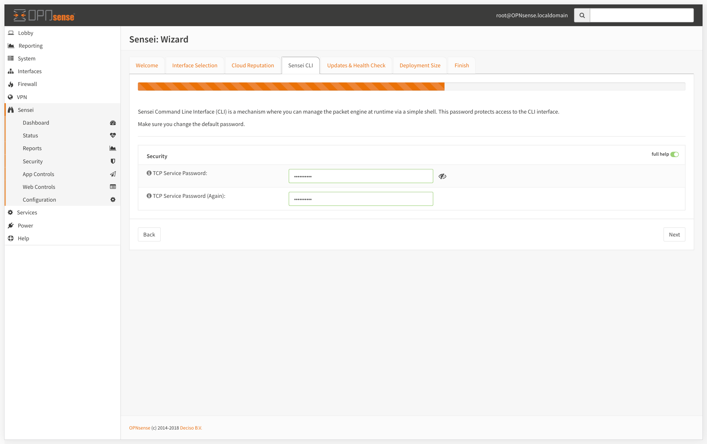

=====================
Sensei: Installing
=====================

.. Note::

    Sensei Freemium Edition is **forever free-of-charge**. We strongly recommend you register to keep in touch with updates and new features. You can register at `https://www.sunnyvalley.io/sensei <https://www.sunnyvalley.io/sensei>`_

-----------------------------

Connect to Your Firewall
-----------------------------

.. code-block:: bash

    $ ssh root@your-firewall-ip

After a successful login, enter "8" as the option to drop to the shell

.. image:: images/opnsense-terminal-1.png
    :width: 100%

-----------------------------

Download & Run Sensei Installer
--------------------------------
Run the following one-liner command to download and invoke the installer script.

.. code-block:: bash

    root@fw:~ # curl https://updates.sunnyvalley.io/getsensei | sh

.. image:: images/opnsense-terminal-3-getsensei-1.png
    :width: 100%

Hence we passed the downloaded script to ``sh``, it will automatically run the installer script.

.. code-block:: bash

    Installing via OPNsense installer
    Do you wish to install Sensei? y

Install script will copy the installation files onto the filesystem and will add a menu item within the Firewall Web User Interface.
Depending on your computer setup and your internet connection speed, it might take 1-4 minutes to complete.

.. Note::

    You can get detailed info about suggested hardware on :doc:`sensei_hardwarerequirements`

Once the install is completed, you can disconnect from your terminal, and disable your firewall's ssh service by unchecking the checkboxes mentioned above.

-----------------------------

Initial Configuration Wizard
------------------------------

.. Note::

    To start using Sensei, first, you need to go through the Wizard which will guide you to start with the best initial configuration.

To start your "Initial Configuration Wizard";

* Log in to your OPNsense Web UI,
* Click Sensei from the left menu,
* Click on the Dashboard sub-menu. It will open up the Wizard.

------------
**1- EULA**
------------

* Accept the End User License Agreement *(Scroll & read the terms to get to the next button)*.
* Click :menuselection:`Next` and get to the :menuselection:`Interface Selection` section.

-----------------------------
**2- Interface Selection**
-----------------------------

* Select the Ethernet Interfaces to protect. To do that, click on an interface and use the right/left arrow buttons to move it to protected/unprotected interfaces combo box.
* Click :menuselection:`Next` and get to the :menuselection:`Cloud Reputation` section.

.. image:: images/sensei-0-wizard-tab2-interface-selection-2.png
    :width: 100%

--------------------------
**3- Cloud Reputation**
--------------------------

The Cloud Threat Intelligence data is queried real time when anyone makes a connection through your network. It enables us to respond to malware and wireless outbreaks in real time and very fast.

The engine processes the request, queries to **SVN Cloud** in real-time and decides whether it will be blocked or allowed. We check against 140+ Million Websites, under 120+ categories in milliseconds.

Cloud Threat Intel settings let you;

* Enable/Disable the cloud reputation & web categorization engine
* Set local domain settings to be excluded from cloud queries

--------------------------------
**4- Sensei CLI (Security)**
--------------------------------

* Set your TCP Service password. This password protects the command line based CLI access to the packet engine. It is highly recommended to set this with a secure one.
* Click "Next" and get to the "Updates" .

-------------------------------
**5- Updates & Health Check**
-------------------------------

.. Note::
    Sensei uses OPNsense package system to deliver its updates. Configure the way you receive your Sensei updates as you feel convenient.

* **Self Health Check:** If enabled, "Self Health Check" monitors the system's memory, CPU, disk usage and core services if they're working correctly, and raises alerts if anything goes wrong. Self Health Check also stops the relevant services if they're consuming excessive system resources.
* **Check for Updates Automatically:** Checks automatically for the updates and creates a notification on the status page.
* **Update Databases and Threat Intelligence Data Automatically:** Checks automatically for the updates and creates a notification on the status page .
* **Enable Generation of Support Data:** If enabled, Sensei collects supporting data during unusual events and crashes. You can share this data while opening a ticket with us.

.. image:: images/sensei-0-wizard-tab5-updates-health-check.png
    :width: 100%

--------------------------
**6- Deployment Size**
--------------------------

Sensei supports up to 1,000 concurrent users on an everyday PC. You can set your Sensei installation's capacity here.

.. Note::
    You can get detailed info about suggested hardware on [Getting Started &gt; Hardware Requirements​](getting-ready.md)

---------------
**7- Finish**
---------------

Click the Finish button to save your initial configuration data and start using Sensei.

.. image:: images/sensei-0-wizard-tab7-finish-1.png
    :width: 100%

-------------------
**Hands-on Video**
-------------------

.. raw:: html

    <iframe width="560" height="315" src="https://www.youtube.com/embed/y6OE2FuzkF0?time_continue=7" frameborder="0" allowfullscreen></iframe>
