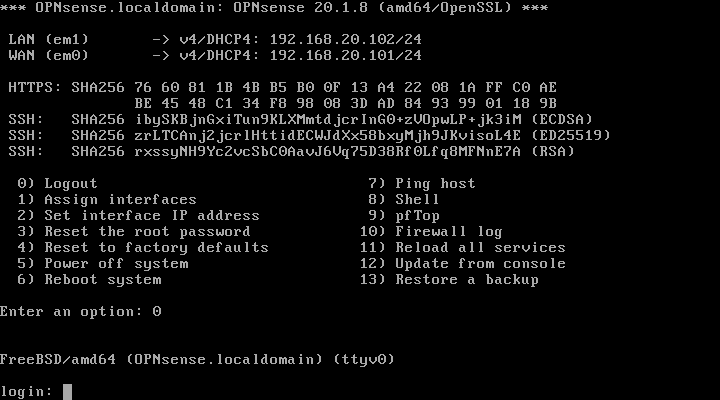
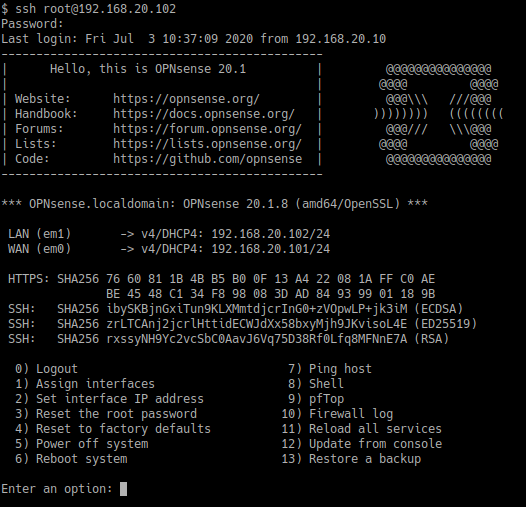

====================================================
Zenarmor : Installing via Command Line
====================================================

Although the preferred method of installation is the web interface, Zenarmor may also be installed using the command line interface via SSH or direct system access. Once Zenarmor is installed, you will need to complete the initial configuration using the web interface.

To install Sensei in OPNsense with the command line interface, you must use an administrative account with shell access.

-------------------------
Command Line Installation
-------------------------

The command line installation method was the primary means for installing Zenarmor before it was officially available on the “Plugins” page in the OPNsense web interface. This option is still available for users who have direct access to the OPNsense system yet prefer using command line tools or who may only have remote shell access via SSH to administrate their OPNsense installations. However, accessing the web interface is still necessary after installation to complete the initial configuration of Zenarmor.

You may install Zenarmor if you have local system access to OPNsense or remote access using SSH.

....................
Local System Access
....................

When you have local access to OPNsense, you may simply log into OPNsense using the “root” user or another administrator account. You should see a list of OPNsense menu options.

....................
SSH Access
....................

If you only have shell access to OPNsense, you may install Zenarmor remotely by logging into OPNsense using a SSH client with the following command where “root” is the administrator account and “your-firewall-ip” is the IP address or hostname of the OPNsense system. You should see a list of OPNsense menu options.

.. code-block:: bash

    $ ssh root@your-firewall-ip

..................................
Download & Run Zenarmor Installer
..................................

Once you are successfully logged into OPNsense either by local system access or SSH, enter option “8” to open the shell. Run the following commands to install vendor repository and Zenarmor package.

.. code-block:: bash

    pkg install os-sunnyvalley

.. code-block:: bash

    pkg install os-sensei

This will copy the installation files onto the filesystem and will add a top-level menu item within the OPNsense web interface. Depending on the speed of your hardware and Internet connection, the installation may take several minutes to complete.

Once the installation has been completed, you may disconnect from your terminal session.

You will now need to complete the “Initial Configuration Wizard” for Zenarmor to be fully operational. See the :ref:`Initial Configuration Wizard <Sensei_Initial_Configuration_Wizard>` section for information.
