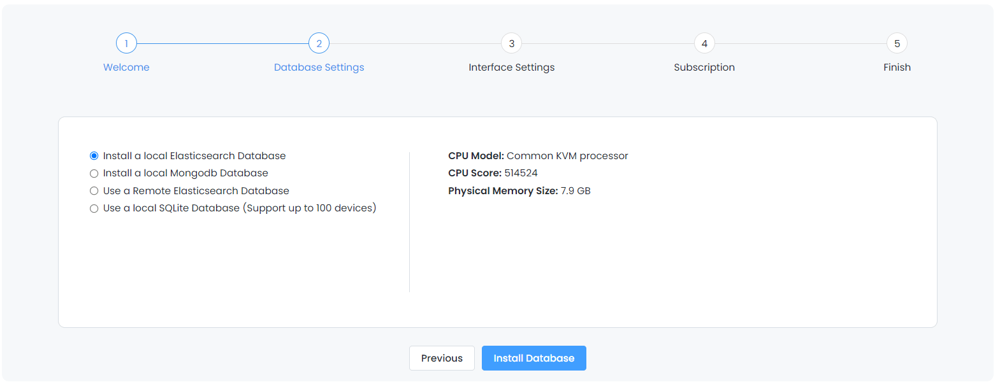
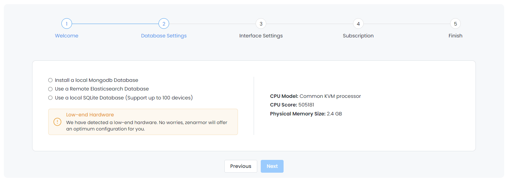
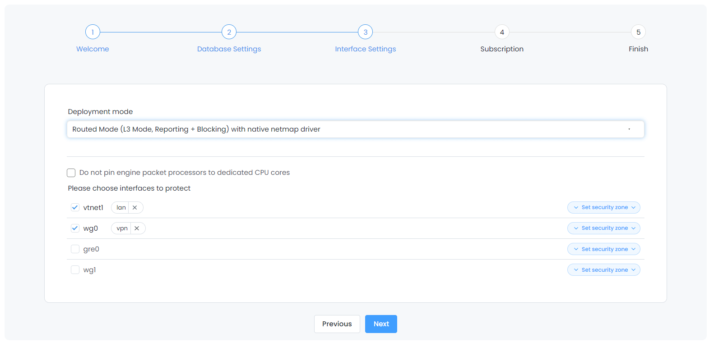

==================================================
Zenarmor (Sensei): Installing via Web Interface
==================================================

.. Note::
 
    Zenarmor Free Edition is **forever free-of-charge**. We strongly recommend you register to keep in touch with updates and new features. You can register at `https://www.zenarmor.com/zenarmor-next-generation-firewall <https://www.zenarmor.com/zenarmor-next-generation-firewall>`_
   

Zenarmor may be installed using the web interface in OPNsense or using the command line interface via SSH or local system access (see :doc:`zenarmor_cmd_install`). The preferred method is the web interface because the process of installing plugins in OPNsense is simple, and Zenarmor requires the use of the web interface to complete the initial configuration after installation.

To install plugins in OPNsense, you must use an account with administrative access.

.. Note::

    Before installing Zenarmor, you should ensure you meet the minimum system requirements in order to run Zenarmor or have the best user experience. See :doc:`zenarmor_hardwarerequirements` for more information.

----------------------------
Web Interface Installation
----------------------------

To install Zenarmor, you must first install the Sunny Valley Networks vendor repository plugin. Go to the :menuselection:`System --> Firmware --> Plugins` page. Click on the “+” icon next to os-sunnyvalley to install the plugin.

Once the vendor plugin is installed, you should see the Zenarmor plugin available in the list of plugins as os-sensei. If you do not see the Zenarmor plugin, you may need to refresh the “Plugins” page. Click the “+” icon next to os-sensei to install the plugin.

After installing Zenarmor, you should see the Zenarmor menu in the left sidebar of the OPNsense web interface. If you do not see the new, top-level menu, you may need to refresh the page.

.. image:: images/zenarmor-install-complete.png
    :width: 100%

Next, you will need to complete the “Initial Configuration Wizard” for Zenarmor to be fully operational.

.. _Sensei_Initial_Configuration_Wizard:

------------------------------
Initial Configuration Wizard
------------------------------
Regardless of the installation method you used, you will need to complete the initial configuration wizard before you may start using Zenarmor.

To start the "Initial Configuration Wizard":

* Log in to your OPNsense web interface
* Click Zenarmor from the left menu
* Click on the Dashboard sub-menu to open the configuration wizard

....................
1- Welcome
....................

* Accept the Terms of Service and Privacy Policy by clicking on the checkbox. 

.. image:: images/zenarmor-wizard-welcome.png
    :width: 100%

* Click the :menuselection:`I Agree` button to continue to the :menuselection:`Hardware Check & Reporting Database` section.

....................
2- Hardware Check & Reporting Database
....................

Your hardware will be analyzed to ensure it meets the minimum requirements. You will receive one of the following responses: compatible hardware, low-end hardware, incompatible hardware. The setup will not continue if you have incompatible hardware.

*Compatible*

.. image:: images/zenarmor-wizard-hardware-low-end.png
    :width: 100%

*Low-end*

.. image:: images/zenarmor-wizard-hardware-incompatible.png
    :width: 100%

*Incompatible*

* Select the database you wish to use for reporting. High-end systems will have 3 options, while low-end systems only have 2 options.

After the wizard completes the hardware analysis, select the database you wish to use for reporting. High-end systems will have 4 options, while low-end systems only have 3 options except Local ElasticSearch DB.

.. Note::

Zenarmor offers the following Database deployment options:

-Local ElasticSearch DB

-Remote ElasticSearch DB

-MongoDB Database

-SQLite Database

.. Warning::

    If you wish to use a remote ElasticSearch database, you must choose it now since you cannot change this after the initial configuration wizard has been completed.

*High-end*

*Low-end*

* If you select “Use a Remote Elasticsearch Database”, you will be prompted to enter the URL, username, and password.

.. Note::

    If you have SOHO or higher Zenarmor paid subscription, we recommend that you install your license key before proceeding with the initial configuration wizard since this will activate a feature that will enable you to have central reporting for many firewalls from a single Elasticsearch instance. Otherwise, only a single remote ES instance can be used with a single firewall.

.. image:: images/zenarmor-wizard-reporting-database-remote.png
    :width: 100%

Click the Install Database button to install the local database if one is chosen and to continue to the Interface Selection section.

Click the Next button to proceed with interface selection.

* Click the :menuselection:`Next` button :menuselection:`Interface Selection` section.

.......................
3- Deployment Mode & Interface Selection
.......................

You may follow the instructions for Zenarmor deployment mode and interface selection:

Select the deployment mode depending on your topology and requirements. By default, the Routed mode with emulated netmap driver option is selected on OPNsense. You may find detailed information in the "Deployment Modes Guide", see `here <https://www.zenarmor.com/docs/guides/deployment-modes>`_. 

**PREREQUISITE**

Before selecting Netmap driver deployment options, make sure that the hardware offloadings are disabled on your node. Since the Hardware Offloading feature is incompatible with Netmap.

You may check the CPU Pinning option. Zenarmor has a setting to make CPU pinning optional, giving you more flexibility in how you configure your system for optimal performance. By default, Zenarmor is pinned to a dedicated core in order to prevent CPU context-switching overhead. Because if the process wanders between CPU processors, CPU cache misses occur, which has a negative impact on performance.

You may disable this setting depending on your requirements by clicking on the Do not pin engine packet processors to dedicated CPU cores option.

* Select the Ethernet Interface(s) to protect. To do so, click on an interface and use the right or left arrow buttons to move it to the protected/unprotected interfaces combo box.

For detailed information on "Deployment Modes", see `here <https://www.zenarmor.com/docs/guides/deployment-modes>`_. 

Click the Set Security Zone drop-down menu to assign a tag for the interface. You may set a custom security zone name or select one of the options available, such as DMZ, LAN, guest, wifi, or wan.

To add a custom security zone tag, click the Custom button in the Set Security Zone drop-down menu. After typing the new security zone name, such as vpn, click Add button.

....................
4-  Activate Subscription
....................

Installation wizard offers you the following options in this step:

* Start 15-day Free Trial of a Business Subscription
* Activate your current subscription key
* Continue with the Free Edition

If you wish to try the 15-day Free Business Edition, select the Get Me 15-day Free Trial of Business Subscription option and type your e-mail address to claim your subscription key.

**Tip**
     Everyone who installs Zenarmor and login into their Zenconsole may take advantage of a 15-Day Free Trial of Zenarmor Business Edition without entering credit card information.

* Click :menuselection:`Next` to continue to the :menuselection:`Finish` section.

If you have a subscription, select I already have my subscription key option to activate your subscription key.

You may also use the Free Edition by selecting the Get Me the Free Edition option. You may enter your email address if you wish to subscribe to the Zenarmor email list to stay up-to-date on the latest news.

Click Next to proceed to the Finish section.

....................
5- Finish
....................

* Click the :menuselection:`Complete` button to save your initial configuration data and start using Zenarmor.

