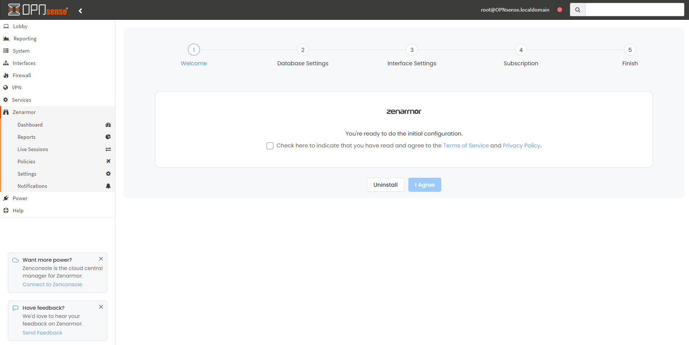
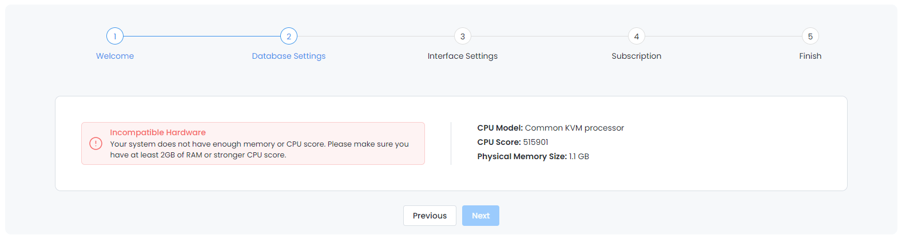
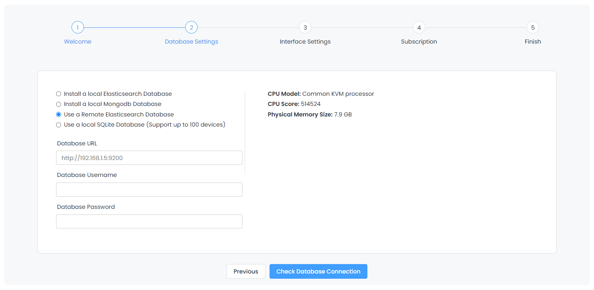

==================================================
Zenarmor (Sensei): Installing via Web Interface
==================================================

 **Note**
 
    Zenarmor Free Edition is **forever free-of-charge**. We strongly recommend you register to keep in touch with updates and new features. You can register at `https://www.sunnyvalley.io/open-source-firewalls <https://www.sunnyvalley.io/open-source-firewalls>`_
   

Zenarmor may be installed using the web interface in OPNsense or using the command line interface via SSH or local system access (see :doc:`zenarmor_cmd_install`). The preferred method is the web interface because the process of installing plugins in OPNsense is simple and Zenarmor requires the use of the web interface to complete the initial configuration after installation.

To install plugins in OPNsense, you must use an account with administrative access.

.. Note::

    Before installing Zenarmor, you should ensure you meet the minimum system requirements in order to run Zenarmor or to have the best user experience. See :doc:`zenarmor_hardwarerequirements` for more information.

----------------------------
Web Interface Installation
----------------------------

To install Zenarmor, you must first install the Sunny Valley Networks vendor repository plugin. Go to the :menuselection:`System --> Firmware --> Plugins` page. Click on the “+” icon next to os-sunnyvalley to install the plugin.

Once the vendor plugin is installed, you should see the Zenarmor plugin available in the list of plugins as os-sensei. If you do not see the Zenarmor plugin, you may need to refresh the “Plugins” page. Click the “+” icon next to os-sensei to install the plugin.

After installing Zenarmor, you should see the Zenarmor menu in the left sidebar of the OPNsense web interface. If you do not see the new, top-level menu, you may need to refresh the page.

Next, you will need to complete the “Initial Configuration Wizard” for Zenarmor to be fully operational.

.. _Sensei_Initial_Configuration_Wizard:

------------------------------
Initial Configuration Wizard
------------------------------
Regardless of the installation method you used, you will need to complete the initial configuration wizard before you may start using Zenarmor.

To start the "Initial Configuration Wizard":

* Log in to your OPNsense web interface
* Click Zenarmor from the left menu
* Click on the Dashboard sub-menu to open the configuration wizard

....................
1- Welcome
....................

* Accept the Terms of Service and Privacy Policy by clicking on the checkbox. 

* Click the :menuselection:`Proceed` button to continue to the :menuselection:`Hardware Check` section.

....................
2- Hardware Check
....................

Your hardware will be analyzed to ensure it meets the minimum requirements. You will receive one of following responses: compatible hardware, low-end hardware, incompatible hardware. The setup will not continue if you have incompatible hardware.

.. image:: images/zenarmor-wizard-hardware-high-end.png
    :width: 100%

*Compatible*

.. image:: images/zenarmor-wizard-hardware-low-end.png
    :width: 100%

*Low-end*

*Incompatible*

* Click :menuselection:`Next` to continue to the :menuselection:`Reporting Database` section.

......................
3- Reporting Database
......................

* Select the database you wish to use for reporting. High end systems will have 3 options, while low end systems only have 2 options.

.. Warning::

    If you wish to use a remote ElasticSearch database, you must choose it now since you cannot change this after the initial configuration wizard has been completed.

.. image:: images/zenarmor-wizard-reporting-database-high-end.png
    :width: 100%

*High-end*

.. image:: images/zenarmor-wizard-reporting-database-low-end.png
    :width: 100%

*Low-end*

* If you select “Use a Remote Elasticsearch Database”, you will be prompted to enter the URL, username, and password.

.. Note::

    If you have SOHO or higher Zenarmor paid subscription, we recommend that you install your license key before proceeding with the initial configuration wizard since this will activate a feature that will enable you to have central reporting for many firewalls from a single Elasticsearch instance. Otherwise, only a single remote ES instance can be used with a single firewall.

* Click the :menuselection:`Install Database & Proceed` button to install the local database if one is chosen and continue to the :menuselection:`Interface Selection` section.

.......................
4- Interface Selection
.......................

* Select the Ethernet Interface(s) to protect. To do so, click on an interface and use the right/left arrow buttons to move it to protected/unprotected interfaces combo box.

For detailed information on "Deployment Modes", see `here <https://www.zenarmor.com/docs/guides/deployment-modes>`_. 

.. image:: images/zenarmor-wizard-interface-selection-available.png
    :width: 100%

.. image:: images/zenarmor-wizard-interface-selection-protected.png
    :width: 100%

* Click :menuselection:`Next` to continue to the :menuselection:`Cloud Reputation` section.

....................
5- Cloud Reputation
....................

The Cloud Threat Intelligence data is queried in real-time when any connections are made through your network. This capability enables Zenarmor to respond to malware and wireless outbreaks in real-time and very quickly.

The engine processes the request, queries the **“Sunny Valley Network (SVN) Cloud”** in real-time, and decides whether it will be blocked or allowed. Zenarmor checks against 300+ million websites under 120+ categories in milliseconds.

Cloud Threat Intel settings let you:

* Enable/Disable the “Cloud Reputation & Web Categorization” engine
* Set local domain name you wish to be excluded from cloud queries
* Select the fastest Cloud Reputation Servers which are used for queries

.. image:: images/zenarmor-wizard-cloud-reputation.png
    :width: 100%

* Click :menuselection:`Next` to continue to the :menuselection:`Updates & Health Check section` section.

..........................
6- Updates & Health Check
..........................

.. Note::

   Zenarmor uses the OPNsense package system to deliver its updates. You may configure how you prefer to receive your Zenarmor updates.

* **Check for Updates Automatically:** Checks automatically for the updates and creates a notification on the Zenarmor “Status” page.
* **Automatically Update Databases and Threat Intelligence Data:** Checks automatically for the updates and creates a notification on the Zenarmor “Status” page.
* **Enable Generation of Support Data:** If enabled, Zenarmor collects supporting data during unusual events and crashes. You can share this data when opening a ticket with us.
* **Max Swap Utilization:** You may specify how much swap space Zenarmor may utilize when the system is low on memory. It is recommended that you do not set this value too high. Otherwise, system performance may suffer.
* **Health Check:** If enabled, "Health Check" monitors the system's memory, CPU, disk usage and core services if they're working correctly, and raises alerts if anything goes wrong. "Health Check" also stops the appropriate services if they're consuming excessive system resources.
* **Help Sunny Valley Improve Its Products and Services:** If enabled, general system information is submitted to Sunny Valley to help improve the future development of Zenarmor.

* Click :menuselection:`Next` to continue to the :menuselection:`Deployment Size` section.

....................
7- Deployment Size
....................

Zenarmor may support up to 1,000 concurrent users on an average PC. You can set your Zenarmor installation’s capacity in this section.

.. Note::

    You may see detailed information about suggested hardware at :doc:`zenarmor_hardwarerequirements`

* Click :menuselection:`Next` to continue to the :menuselection:`Finish` section.

....................
8- Finish
....................

* You may enter your email address if you wish to subscribe to the Sunny Valley email list to stay up to date on the latest news.

.. image:: images/zenarmor-wizard-finish.png
    :width: 100%

* Click the :menuselection:`Finish` button to save your initial configuration data and start using Zenarmor.

-------------------
**Hands-on Video**
-------------------

.. raw:: html

    <iframe width="560" height="315" src="https://www.youtube.com/watch?v=Hvz1qhNBZdo" frameborder="0" allowfullscreen></iframe>

